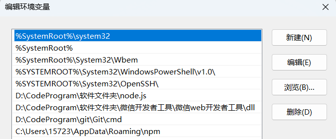
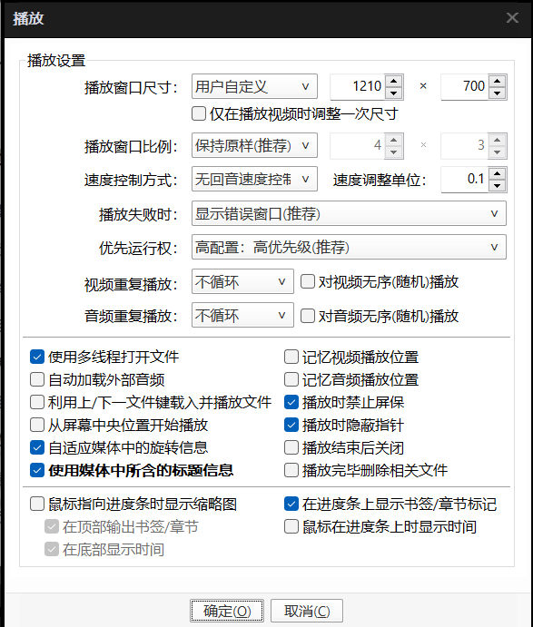
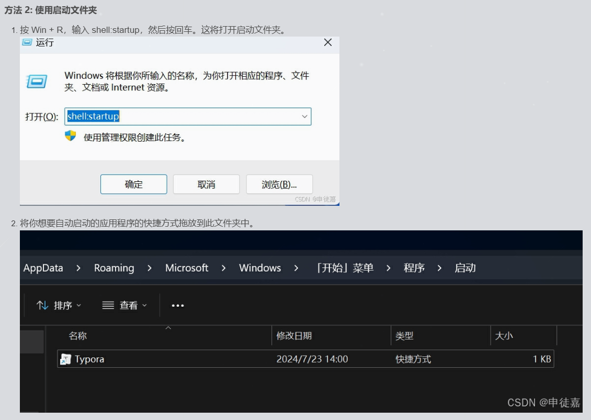

# 原则

## 不要轻易移动node文件夹安装位置
不然可能node npm 环境变量位置变了 导致用不了

### 还可能导致pnpm也用不了
下图的这个 C:\Users\15723\AppData\Roaming\npm 地址

不仅是npm的老家 也是pnpm的老家 

如果位置移动 又要去调位置 是浪费精力的事情
{width=400px}

{width=400px}


# 常见的技术问题
上B站解决是最好的 还有B站 CSDN 豆包 更好的AI

## 解禁网页复制代码
javascript:void($={});

## XMind软件不能改完名后移动，没保存移动再打开直接没

## 80端口占用问题
需要先查看端口占用情况，在命令行中输入
netstat -ano | findstr 80

输入，查看被占用情况
C:\Windows\System32>netsh http show servicestate

然后去计算机-管理-服务中关闭

## npm镜像指令
修改为国内镜像代码: https://registry.npmmirror.com/
查看镜像下载地址: npm config get registry
转为国内镜像地址:npm config set registry https://registry.npmmirror.com

## Tomcat端口被占用问题
netstat -ano | findstr :1099

这将显示占用端口的进程ID。然后，可以使用以下命令终止该进程：

taskkill /F /PID <进程ID>

## vpn账号密码
学校vpn账号: 0603220153
密码: Zhs174253.

## vue3开发遇到的问题
软件开发过程中遇到问题：两个原则：1.找GPT  2.分析要解决什么问题(问题的根源)，我要解决的问题会不会和之前操作过的项目冲突，

第一个问题: 无法加载通过CDN加载vue3时：
1.调试出错
2.丢给gpt改错
1.还有一个更直接的方法，就是连接手机热点

第二个问题: 当使用localhost...后显示模块未加载
原来是我之前配置过的商城项目(tpshop)导致我无法加载本地网页,因为动过
1.D:\phpStudy\Apache\conf\extra
2.C:\Windows\System32\drivers\etc\hosts
3.用记事本打开文件：D:\phpStudy\Apache\conf\httpd.conf,
找到：DocumentRoot  "D:\phpStudy\WWW 修改成：DocumentRoot  "D:\phpStudy\WWW\tpshop"

第三个问题： 如果已经创建了vue3项目没有关闭eslint 
那么就在vue.config.js中添加
module.exports={
    lintOnSave:false  <- 这行代码解决
}

第四个问题: 修改组件的名称后只能引用旧组件名称的问题
需要在修改旧组件名称后使用，npm run build 或 npn run serve 重新运行项目以引入改名后的新组件

第五个问题: vue快捷键
点击vscode左下角的小齿轮，点击用户代码片段，输入vue.json
然后复制以下代码:
::: details Click me to view the code
```js
{
	"Print to Vue&html base code": {
		"prefix": "vue!",
		"body": [
			"<template>"
			"	<div>"
			""
			"	</div>"
			"</template>"
			""
			"<script>"
			"	export default{"
				"  		data() {",
					"    		return {",
						"",
					"    		}",
				"  		}",
			"	}",
			"</script>"
			""
			"<style>"
			""
			"</style>"
		],
		"description": "Vue&html base code"
	}
}
```
:::


## 把数据库的数据回显到页面上的流程
主要任务流程: 有一个数据库测试类 去数据库拿数据 然后通过request存储 然后转发给
jsp显示

1.把数据库的数据 显示在后端 

2.然后通过request存储 

3.然后转发给jsp显示

4.无法通过写死来执行sql语句 使用了js的for循环 和 settimeout又会无限循环

5.数据传输问题最终通过 form 表单 sessionStorage 完成
::: details Click me to view the code
```js
<form id="postDataForm" action="http://localhost:8080/Shop_war_exploded/echo" method="POST" style="display: none;">
    <input type="hidden" name="is_hot" id="is_hot" value="">
</form>

<script>
    if (!sessionStorage.getItem('formSubmitted')) {
        document.getElementById('is_hot').value = 1; // 设置is_hot的值
        document.getElementById('postDataForm').submit(); // 提交form表单
        sessionStorage.setItem('formSubmitted', 'true'); // 记录表单已提交
    } else {
        console.log('Form already submitted. Preventing multiple submissions.');
    }
</script>
```
:::


## 名词疑惑
Vue全家桶
PHP框架（TP、yii2、Zend）

npm/yarn、webpack、mock、eslint，requireJS，gulp

## 修复xampp
1. 解决启动不了apache的问题

最终是这个方案解决 ★

这里提供两种主要的解决方法，方法如下：


方法1：（配置路径）
首先，检查一下自己的环境变量的path中是否还残留以前自己添加的xampp路径，如果有就删掉，如果没有就进行下一步。

 然后就要进入自己的注册表：win+r打开运行对话框--->输入regedit回车，进入注册表--->点击HKEY_LOCAL_MACHINE---->SYSTEM---->currentControlSet---->Services---->找到Apache2.4，你就会在右边看到

ImagePath看看那个路径是不是以前那个版本的路径，如果是就选中ImagePath点击右键修改，把xampp里面提示的Expected Path后面的路径粘贴进去，然后确定。

最后，重启xampp就可以了，启动apache。

ex:
apache的端口号修改为82端口 进去的代码为
http://localhost:82/dashboard/

2.解决进不去mysql的问题

最终解决方案 ★

3.修改密码：启动MySQL服务，登录MySQL，此时提示输入密码，输入任意密码回车即可进入MySQL。

#登录mysql

mysql -u root -p

★ 当使用xampp的mysql时候 登录也是直接按回车进去


## potplay播放时的页面尺寸设置
{width="350px"}

{width="350px"}

{width="450px"}

## 快速替换md文档中因移动文件夹造成图片路径不正确
选中../ 或 ../../部分 然后按住ctrl+d选中全部修改

## 如何解决vscode使用npm命令的时 弹出“你要如何打开这个文件”的问题
https://blog.csdn.net/2401_85983421/article/details/139964626


## 如果修改less文件发现网页没动 解决方案
修改一下less文件之后 看看css文件有没有修改

检查less插件是否开启

## 设置开机启动项
二号方法最简单实用

https://blog.csdn.net/ChuJian_cao/article/details/141216539


## 设置.bat文件 开机启动
具体方法:

进入到某个要启动的程序的 文件所在位置

在该位置下新建一个 xxx autorun.bat文件

然后在该文件中输入 start 应用程序.exe

然后将这个.bat文件的快捷方式 发送到

win+r打开 shell:Startup 这个里面

注意：

一个程序一个 bat文件 不要想在一个bat文件里面打开多个文件

不现实 因为要转盘符、遇到中文文件夹 都有可能出错 

对了应用程序名 不能带空格

一个打开例子
@echo off
start "C:\Program Files (x86)\Microsoft\Edge\Application\msedge.exe" https://www.baidu.com/

dir D:\CodeProgram\软件文件夹\MicrosoftVSCode\Code.exe

## sider AI在使用得热火朝天的时候不要去点刷新 否则就会重置
有可能听不懂你刚刚问的问题


## 不同的AI 使用区别

siderAI 在知识点解释和例子方面 不够清晰和直观 

例子变量 又臭又长

但好处是 它经常给具体的方法 和 一些高难度的新思路

问知识点 问豆包

## 查找MDN稳定内容 在这个输入框 以及路径
{width=300px}

路径


## 电脑窗口位置设置


## 电脑一键搜索所有窗口快捷键
window + d

再次按下 会回到刚才的 窗口状态

## B站视频总结 不想看视频的时候 可以看文字快速过掉
点AI小组手 有总结 视频字幕
{width=500px}

当用户在浏览器中输入一个 URL，并按下回车键，整个过程涉及多个步骤，包括 DNS 查询、TCP 连接、HTTP 请求响应等。我们将按照您提到的各个步骤详细解释这个流程。

## 输入 URL 到页面加载完成

1. **浏览器查找域名对应的 IP 地址**：
   - 用户在浏览器中输入 URL（如 `http://example.com`）。
   - 浏览器会首先检查自己的 DNS 缓存，看看是否已解析过该域名及其对应的 IP 地址。如果缓存中没有，查询将继续进行。
   - 如果未在浏览器缓存中找到，查询将继续到操作系统缓存、路由器缓存，然后是 ISP 的 DNS 缓存，最后可能会触及根域名服务器。这个过程通常遵循以下顺序：
     - **浏览器缓存→操作系统缓存→路由器缓存→ISP DNS 缓存→根域名服务器**。

2. **浏览器向 Web 服务器发送一个 HTTP 请求（TCP 三次握手）**：
   - 一旦解析得到了 IP 地址，浏览器将通过 TCP 建立连接。这个过程包括三次握手：
     1. 浏览器发送一个 **SYN** 包到服务器。
     2. 服务器响应一个 **SYN-ACK** 包确认。
     3. 浏览器发送一个 **ACK** 包完成连接。

3. **（如果服务器设置了重定向）服务器 301 重定向**：
   - 当浏览器发送 HTTP 请求后，如果服务器发现请求的 URL 需要重定向（例如，`http://example.com` 重定向到 `http://www.example.com`），服务器会返回一个 301 或 302 状态码，并提供新的 URL。
   - 301 表示永远重定向，而 302 表示临时重定向。

4. **浏览器跟踪重定向地址**：
   - 浏览器收到重定向响应后，会根据新的 URL 重新发起请求。这通常会涉及到重新解析 DNS（如果主机名有所更改）和再次进行 TCP 握手。

5. **服务器处理请求（通过路由读取资源）**：
   - 访问的服务器接受了 HTTP 请求，并根据路由配置处理请求，通常会在服务器上寻找需要返回的资源（如 HTML 文件）。

6. **服务器返回一个 HTTP 响应（报头中把 Content-type 设置为 'text/html'）**：
   - Web 服务器准备好响应后，将返回一个 HTTP 响应，其中包括状态码（如 200 OK）、HTTP 头（如 `Content-Type: text/html` 表示响应内容是 HTML）以及响应体（即 HTML 内容）。

### 2. 页面渲染与资源加载

7. **浏览器进 DOM 树构建**：
   - 浏览器开始解析返回的 HTML 内容，并构建 DOM（文档对象模型）树。这是页面内容的结构表现形式，浏览器将 HTML 元素转换为 DOM 节点。

8. **浏览器发送请求获取嵌在 HTML 中的资源**：
   - 在解析 HTML 的过程中，浏览器会检测到嵌入的资源，例如图片、音频、视频、CSS 和 JS 文件。对于这些资源，浏览器将逐一发送 HTTP 请求来获取它们。
   - 这些请求通常是异步处理的，以最大化加载效率。

### 3. 页面显示与用户交互

9. **浏览器显示完成页面**：
   - 当所有 DOM、CSSOM（CSS 对象模型）、渲染树构建完成后，浏览器会进行页面的布局（计算元素在屏幕上的位置）并进行绘制（将内容显示在屏幕上）。
   - 如果浏览器为页面指定了 JavaScript 文件，JS 会被解析并执行，可能会对此页面内容进行动态修改。

10. **浏览器发送异步请求**：
    - 之后，如果页面包含 JavaScript，可以在用户与页面交互时发送异步请求（例如使用 AJAX 获取更多数据，更新页面某一部分而无需重新加载整个页面），这样可以增强用户体验。

### 总结

从输入 URL 到页面完全加载显示的过程涉及多个复杂而精细的步骤，包括网络协议、服务器响应、浏览器渲染、资源加载等。各个步骤相互关联，确保用户能够高效、顺畅地访问和使用网页。理解这个流程有助于更好地优化网站性能和用户体验。如果您对某一具体步骤还有疑问，欢迎随时提问！

## 解决该死的md文档标题无法折叠问题
设置 => 下翻找到该文档的 setting.json 

然后将这个改为auto

"editor.foldingStrategy": "auto",


