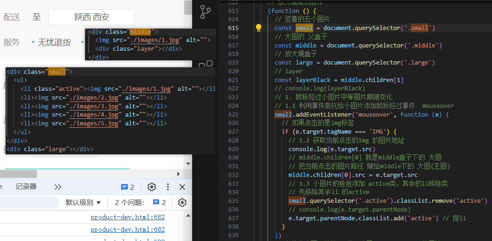
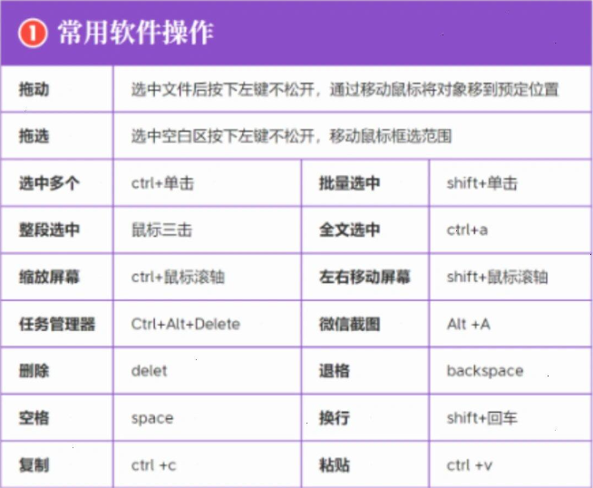

# 编程学习方法

## heima学习方法

### 倍速
2倍速适合过那些烂掉的知识点

一般还是要1.5倍速来听 因为这样吸收的更全

## 第三个时期学习方法(Level 3)⭐
注意❗ 必须按照流程 老老实实来 

直接使用第二遍方法可能造成某些知识看不懂

或者发生难以解决的错误
### 第一遍 
需要使用先过一遍视频 跟一波他们的学习方法、风格 

注意 最好不记知识点 直接使用他们的文档 更快 ⭐

视频是在概念模糊的时候使用的

在学如原型对象这种 看文档、画图、看视频理解就会对学习帮助很大 一般普通知识就不用

### 第二遍
主要使用 思维导图 文档 代码 (三件套)学习

而且思维导图不是必要的 代码才是必要的

补充学习方法: 题目易错点(需要记录) 案例流程(代码流程)

先在文档 和 思维导图 大致了解知识概念 

## 第三遍可以直接关掉声音 使用4倍速或更高熟悉操作
或者你可以在第二遍就用这个方法

能开字幕最好开字幕

### 某个页面知识点拆解
注意这个代码流程最好不使用脑图

不然可能导致把精力花在不必要的地方 舍本逐末

if (代码很长) {
    写代码流程(流程写下来 代码就会变得清晰)

    从零复现(比起写代码 更重要的是 目标)

    做题后 第一遍做错点 要记录下来
} else if (代码不长) {
    看一遍代码从零 复现思路(比起写代码 更重要的是 目标★)

    也可以写代码流程也可以不写(毕竟可以没难度可以直接写出来)

    做题后 第一遍做错点 要记录下来
} (无论代码长或短) {
    能刷到肌肉记忆最好
}

### 工具分析
代码实操: 第一遍和第二遍都需要的东西 加深印象(非常重要 这一步)

视频: 第一遍完全不懂的时候使用 可以快速理解要干什么 为什么要这么干

脑图: 适合前期搭建大致的框架、尤其是router的逻辑可以很好理清

脑图的劣势是在没看视频、或者不知道整体的流程的时候 使用可能导致发生难以解决的错误

文档: 综合分析型优势 可以梳理、整合 错的和对的知识

### 代码实操
需要目标 比如直接打开做好的 然后清空关键代码 让自己做出来

## html+css 移动端适配 js知识类型分析⭐
其实这三种都是知识点 可以使用上面的学习方法

知识类型：点状

而到了node服务端编程 就需要使用📚.md记录过程

知识类型：链条状 无法使用肌肉记忆 记住也会浪费很多时间

只能使用 .md文件 把一步步的过程记录下来

❗不要看视频记知识点 因为 原理、为什么 很多

而在这里 这些 概念型知识点可以在操作中加深记忆 

如果无法在操作中加深记忆 那么就说明记住成本大 不值得

💡而是要看文档 在📚.md中记录下 纯操作步骤 不用解释过于复杂的原理

## 写js要反复看dom的解决办法 也适用于vue2要反复上拉下拉
获取主要的dom并截图 写js 这样避免来回看dom 影响效率

其余的dom可以通过children parentNode等获取操作

特定的知识点 寻找特定的训练 加深理解 比如WebApi

## 题的理解
题是用来考验 有思路 并且给思路加强印象的

不是拿来考验没思路的人 在那里无中生有的

## 逻辑难度有点大的知识点画图(适用于超大项目)
逻辑性不是很强 知识点式的就不用了 正常记录即可

如果是项目代码可以保存xmind文件

如果是普通的上课知识点 建议快速过一遍 直接截图就行了
没必要保存xmind文件

虽然说画图也有必要 但是主要精力还是要集中在代码上
不然光画图也没用

### 做完B站项目的思维导图后的思考
-   一般小项目不用做思维导图

-   大的项目可以做思维导图 主要的功能就是 
整理html结构 看结构 标签合不合理

-   一般做HTML结构图 JS任务封装图

## 一般的技术问题解决途径
B站 sider 百度 闲鱼前端问题解决(要付费)

职业发展规划 => 知乎付费提问、闲鱼付费提问

抖音 => 行情了解

## Xmind使用技巧
{width=600px}

{width=600px}

## 原则
### 原则符号说明
待用标识 😊😂🤣😐😴😓🙃😤😨🤡💩❤️💕😎✨🖤💢🕳️
💫❌❗❓🚫⭕💯✅❎🔴🟠🟡🟢🔵🟣🟤⚫⚪🤦‍♂️🏞️📚

⭐ - 重要
📚 - 主要讲解
💩 – 不重要、错
📄 - 普通文件
❗ - 冗余设计、可能会出错的设计、为了秀而秀的设计并且可能导致大错误
🕳️ - 坑、易错点
⚡ - 极速版 简化注释、代码
✅ - 对
🔧 - 遗留问题 待处理
💡 - 解决思路、衍生想法
🪐 - 过于复杂、冗余、庞大(目前了解 没必要投入大量精力完成的事情)
🏞️ - 场景

### 定期清除不常用知识
比如一直没用查看 用到的 过期的知识

### 精力管理 不搞深入内容 就做切图仔工作

### 一条知识点就是一条知识点 不要去在该点下去延申知识点
会导致代码复制 注释多 不宜阅读

而且容易导致思维中断

### 一是沉迷于知识点式的学习
解决方案：

大致了解重点项即可 过于深入一概不看！

### 二是沉迷于看视频 没输出的学习习惯
解决方案:

一边看视频 一边记知识点 然后背 复现

### 三是沉迷于杞人忧天思想
包括 幻想制作精美文档 供工作使用

幻想制作视频索引等等多余步骤 

实际上文档根本不用我弄 人家都弄好了 就等着我吃

还包括

幻想工作难度大

自己进入后做不了

实际上 这个时候精力管理尤为重要

搞明白自己重点在那里 针对性学习 然后去工作

放心进入工作就是输出 不会让你搞不会的 搞高深莫测的

如果公司难度大 或者后期加大工作难度 大可以离职

那都不重要 现在对自己来说最重要的就是

学重点 找到工作 仅此而已

#### 担心前端做久了 没进步 然后最重要的几年被浪费的解决办法
就做一两年 看看有没有出路 没有出路果断撤

在这一两年内 了解更多其他行业的信息

避免假如其他错误 无发展前途的行业

#### 有些知识适合了解 并不需要去操作⭐
有可能操作的过程 耗费的时间巨大 得不偿失 比如js文件 包化

包化适合大型项目 不适合小型项目

### 注释和内容 字数越少越好 越长越臭⭐

# 编程学习原理

## 在解决如何问题之前 要记得两个原则⭐
什么方法是最简单最快的 什么方法是错误路径

## bug报错直接gpt 这样排查错误最快 针对性⭐

## 适用于任何一种需要学习才能获得技能的方法
-   当遇到问题不要急 最重要的就是慢下来搞清楚原理 
    在基础上迭代才是进步最快的(玩LOL瑞文就是最好的例子)
    打了10年没一点进步 把学校的学习习惯用一点 进步飞速
    罗列出原则 方法 基本知识 最可以往最优路径靠拢

-   正因为所有工作本质上都是对人的消耗 所以才要快速变有钱
    让自己财富自由腰板才直 在自己的体力真正大幅度衰退来临时
    达到一定的社会成就 就可以辅助社会机器运行 而不是被社会
    机器碾压

## 听课要看懂大海报(Level 1)
注意从现在开始 把大海报看懂再继续 追求质量的同时再追求速度
不然听了等于白听

### 遇到问题的几个切入点
-   全局思维解决 慢慢解决 再一步一步细分成小任务 => 解耦思维
-   不要自我创造 要学习别人的思路 禁止钻牛角尖 浪费时间 时间也是一种成本

### 编程思维
在把课听一遍后 先把注释写下来 然后对着注释敲代码

自问自答

