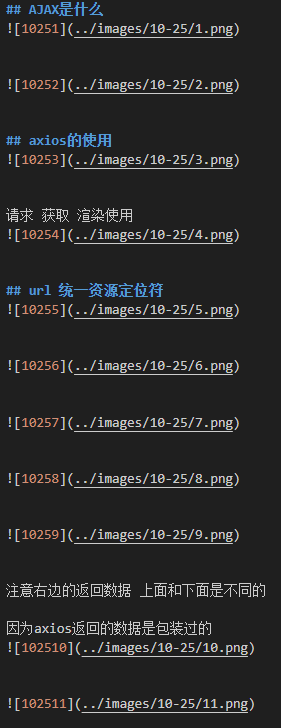
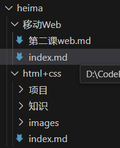
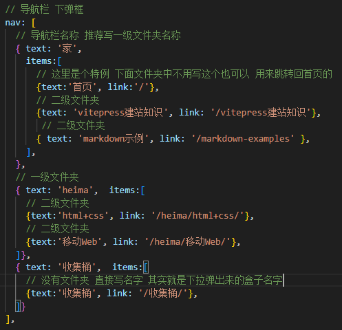
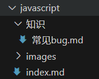
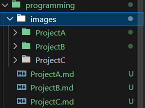
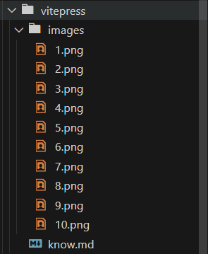
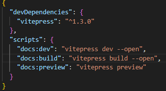
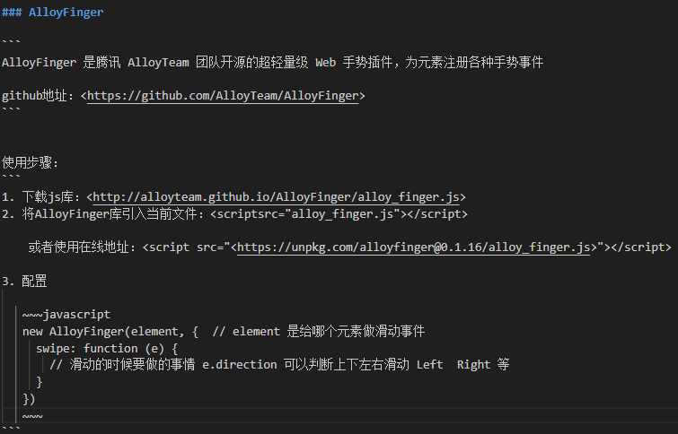

# 使用规则:swimmer:

## vitepress书写格式
:business_suit_levitating:注意事项

★使用图片+二级标题(还可跳转)的方式可读性最高 

不要使用无序列表 显示不好看

建议不要一开始就用 类似于1. 2 如果后期改动 工作量过大


:business_suit_levitating: 具体格式

标题后面紧贴第一句话或图片 =>吸顶

每一段话下面紧贴图片 => 下沉

每一部分中用一个空格 表示这是一个段落 => 中一格
{width=250px}

##  图片放置规则
public放全局图片 也就是最外层这些md文件的图片

二级文件夹中设置images文件夹 用来放置目录路径近的图片

由于给这些bug图片取名字没有意义 所以我
用 (月份-日期-第几个bug) 取名

## 图片路径 黄色警告
这个被注释的第一种的是错误的 不符合最佳实践 应使用第三种
1. <!--  -->

2. <!--  -->

3. {width=250px} ✅

# 基本认知

##  文件夹层级
config.mjs的nav中写一个对象 具体方法如下
{width=200px}

一级文件夹是指最外层的文件夹 
{width=200px}

这个二级文件夹下的index.md建议空着 
二级文件夹要有一个index.md文件，为了自动侧边栏的生成 
当然如果手动侧边栏就不用了 

二级文件夹 就是指移动Web 和 html+css这些文件夹
{width=300px}

三级文件夹 知识、images这些文件夹
{width=200px}


## 嵌入style和script标签
style方式可行 

script方式不可行

## md文档 字体图标
表情和图标的使用 :grinning:

单词的两边要加:号  

然后在下面这个网址拿取自己想要的字体图标

https://github.com/markdown-it/markdown-it-emoji/blob/master/lib/data/full.mjs 

## 图片文件夹 图片命名 图片大小规定
### 图片文件夹
如果二级文件夹下有多个md文件 使用多个ProjectABC文件夹对应上去

然后在config.js中再修改为要显示的文件夹就好了



如果说二级文件夹下 只有一个md文件 那么不用ProjectABC文件夹

直接放图片就好



### 图片命名
直接使用次序 最干净 就算乱序也没事 但能按照1234排列最好

### 图片不要太大 也不要太小 不然需要使用{width=300px}这种来调整 浪费时间

## vitepress官网的 markdown书写语法
https://vitepress.dev/guide/markdown 

## 网站优化的点
二级文件夹的侧边栏收缩 (可学可不学)

## md文档样式学习 训练场
定制集装箱
::: info
This is an info box.
:::

::: details Click me to view the code
```js
console.log('Hello, VitePress!')
```
:::

<hr>

## md文档中也是可以嵌入 style标签代码的
```css
<style>
    /* 自定义分割线样式 */
    hr {
        border: 2px solid gray; 
    }
</style>
```


# 功能
## 启动项目后自动打开设置
在后面加上--open就可以了
{width=250px}

## 侧边栏
config.mjs中的sidebar中设置侧边栏

书写格式如下 

现在改回手动侧边栏 解构清晰
{width=250px}
最外面的md文件 两栏格式(用手动侧边栏还是三栏)

<hr>

# bug处理和收集

## 二级文件夹下必须要有index.md(自动侧边栏 手动的侧边栏不用)
而且名字不能改 一改就无法显示文件夹
{width=150px}

## 项目改名方法 
给这个vitepress项目文件 改名后无法启动的bug 比如: code-demo

删除node_modules 文件夹

终端执行 pnpm install

即可重新运行 (pnpm run docs:dev)

## md文档中 加网址可能报错 可能使用```包裹
{width=600px}

## 网盘文件夹和主要文件夹命名规则
01_main_assets(未使用💩) = 01_assets(正在使用)
01_work_assets(正在使用)

图片文件夹
01_assets
01_work_assets

md文件
01_main
01_work

# 部署
## 部署排错
1. 整理好code-demo的错误
1-1. 控制台错误
1-2. 构建时 无效连接错误
1-3. 图标路径错误
Files in the public directory are served at the root path.
Instead of /public/11-17/1.png, use /11-17/1.png.

1-5 减少项目体积 然后部署后看看路由是否正常

或者在现有基础上减少文件夹看看能不能路由跳转

1-6 文件夹全英文、缩短英文单词长度


2. 尝试构建该项目

3. 如果成功 推送到github仓库 更新仓库内容 

已经成功 但是没有样式

4. 打开手机移动端调试


