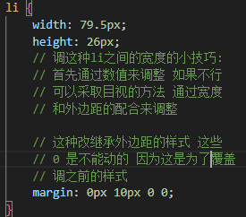
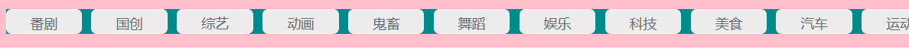
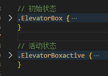
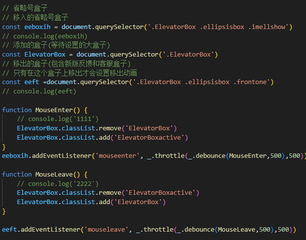
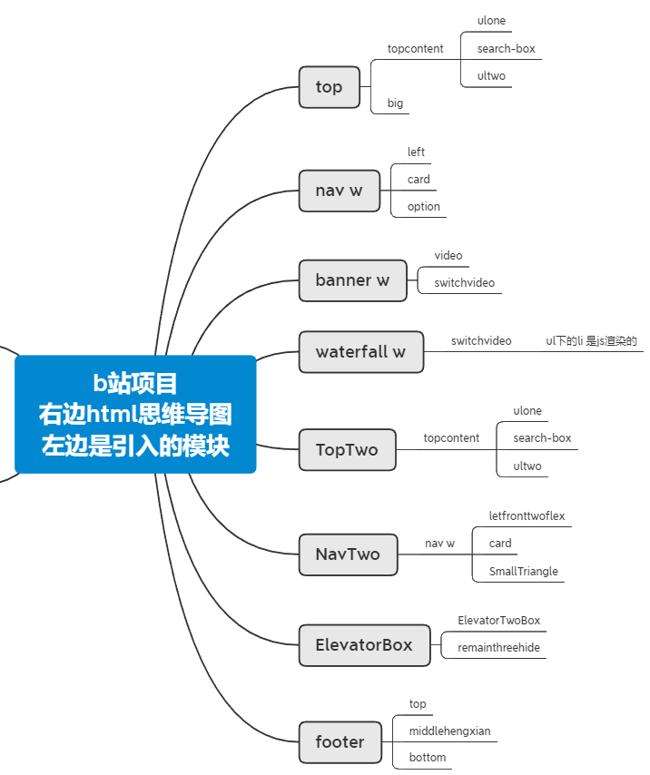
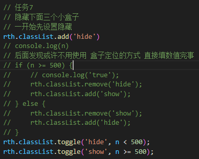
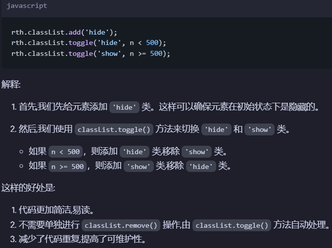

## li之前的距离通过宽度和外边距同时调整

## ★最原始 必成功的状态切换方法
-   先写出两个类 

    一个是开始状态的类

    一个是结束状态的类

    然后通过js切换这两个类 加防抖节流方法

-   这次的技术难点主要是 碰3号盒子(省略号盒子) 

    外面的盒子也会变化的问题(等待设置的大盒子)

    所以这个设置的样式是 3号盒子的父级

    然后设置退出的类 不然碰1号盒子就自动退出

    需求是希望离开这几个盒子的整体 才退出
{width=200px}

{width=400px}

## 类名 可以更加的通用和规范 不用过于具体
{width=400px}

{width=600px}

# 项目升级记录

## if语句切换show hide优化
使用toggle可以确保 覆盖之前的状态 达到清状态的效果
{width=300px}

{width=500px}