# top 和TopTwo的 topcontent问题
## top 和TopTwo的 topcontent问题---------------------------------

## TopTwo栏的盒子自动轮播 的构思

### 想法1 添加类名(提前写好的状态) 通过js移入移出切换状态
第一个想法是给这个a 添加类名

当鼠标移入的时候添加activea类名

实现activea类名盒子的上下移动 

而activea类名中写了 img span 结束位置的状态
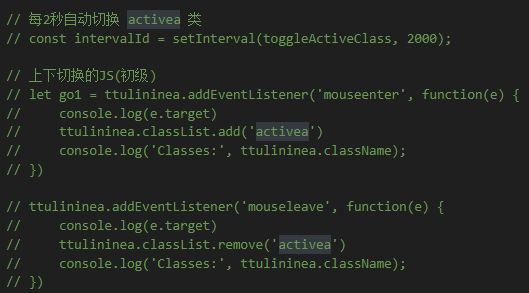

### 想法2 通过间隔函数来自动轮播

设置了一个函数 并且每2秒自动切换类名

在函数写if...else 当进入if时候 会先检查是否

包含activea这个类名 然后如果有移出 没有就else添加类名
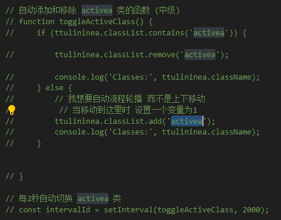

### 想法3 设置状态变量 然后每隔2秒切换状态
定义了一个函数 进入时先清除状态 免得还有上一次

的状态 然后就是根据状态1 状态2 分别添加类名

然后状态结束的把 状态变量重置会1 继续循环
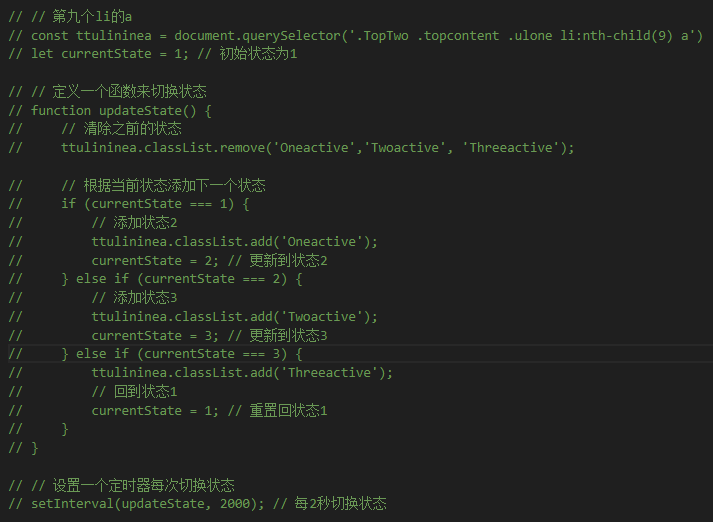{width=500px}

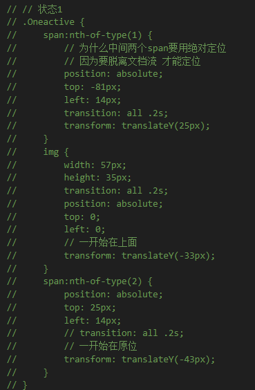{width=300px}

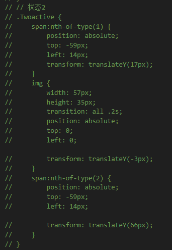{width=300px}

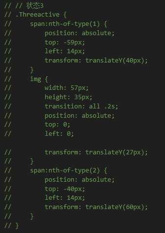{width=300px}

### 想法4 给两个span 和 img 分别设置不同的动画
后面发现 不可控因素太大 该方案弃用
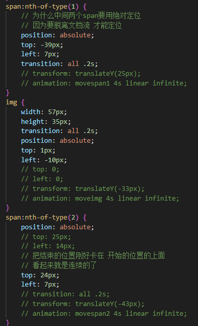{width=300px}

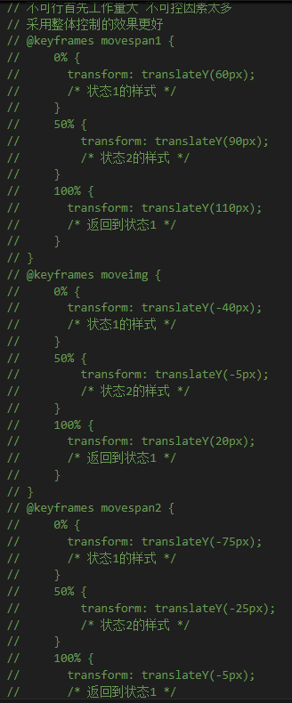{width=300px}

## Top 和 TopTwo 的 topcontent
-   为什么第一个的内容区(top的topcontent)使用绝对定位

    因为设置固定定位 当视口缩小时

    (top的topcontent)会上下移动所以 所以第一个使用绝对定位

    而且本来第一个就不用动 所以使用绝对定位
    {width="700px"}

-   第二个使用固定定位是因为需要在页面下边的位置

    固定在下部分的上方 所以适合固定定位
    {width="700px"}

    代码图
    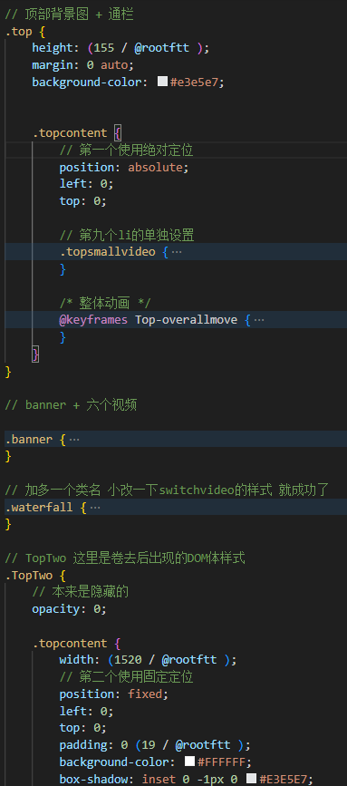{width="300px"}

## Topcontent就抽离ulone盒子其余还是继承的
.search-box和ultwo还是继承样式的

## 失败的继承样式 实例 继承样式 然后在不同的DOM上添加
其实这个b站项目 还是要重新来一般 改为单独样式 不要使用继承样式

topsmallvideo样式 less嵌套有问题
{width="300px"}

因为继承会导致权重问题 所以不好控制
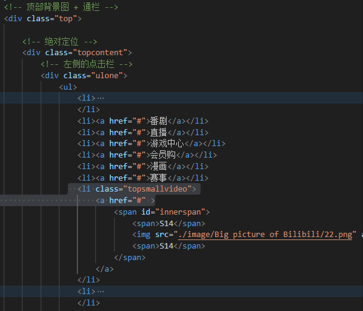{width="300px"}

{width="300px"}

★当分离样式 最终太乱 最终方案是只能使用单独不同的样式去控制

一个失败的继承样式 最终使用单独的样式控制
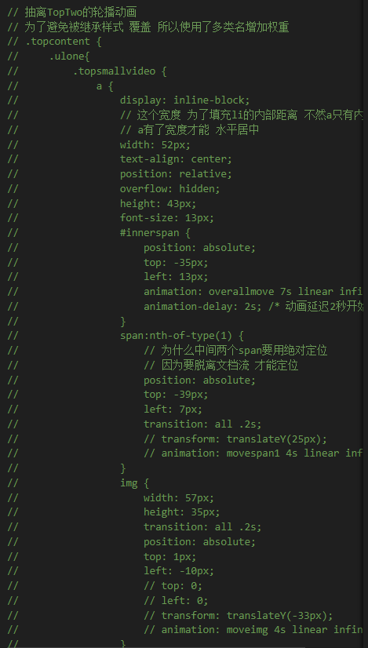{width="300px"}

## a标签可以用公共样式
为什么说这种方法不好因为样式最好单独设置 

公共样式封装组件 这样才好
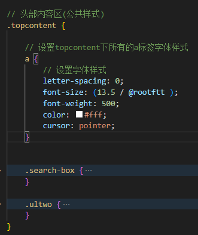{width="350px"}

## 继承导致的问题
继承样式不要写类名太多 不然任意导致继承覆盖

耦合性高 牵一发动全身 

必须在原有的样式基础上改 后续维护困难
### 一个样式两个地方同时使用 并且两个地方还有改动
不推荐这种方法 首先耦合性高 类名多 

而类名多可能导致样式失控 并且理解成本巨大

#### 被继承覆盖时的处理方法
-   需要给其中要修改的盒子

    分别添加不同的单独样式
    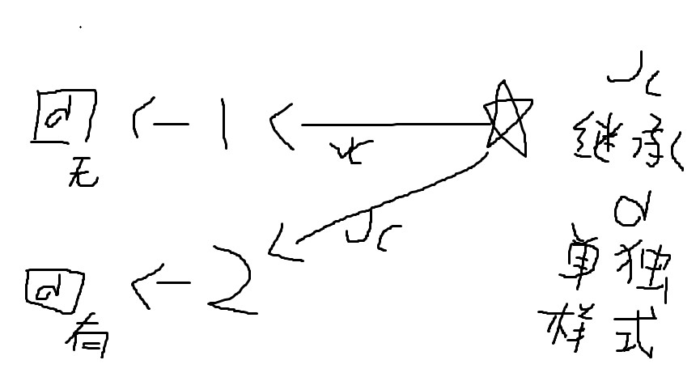{width="350px"}
-   使用多类名增加权重(本案例使用) 不得已使用 已是下策

    使用id选择器

    使用!important调试
    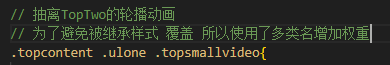{width="300px"}

## 用本地存储记录当前位置 然后下次进入跳回原位
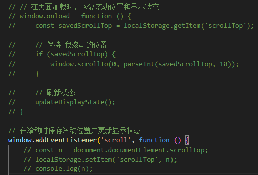{width=500px}
