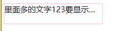

# day10-小兔鲜儿

## 底部盒子制作

~~~html
  <!-- 底部开始 -->
  <div class="footer">
    <div class="wrapper">
     
    </div>
  </div>
  <!-- 底部结束 -->
~~~

~~~css
.footer {
  height: 582px;
  background-color: #F5F5F5;
}

~~~

### 底部服务模块制作

html

~~~html
<!-- 服务 service -->
<div class="service">
  <ul>
    <li>
      <h5>省</h5>
      <p>价格亲民</p>
    </li>
    <li>
      <h5>省</h5>
      <p>价格亲民</p>
    </li>
    <li>
      <h5>省</h5>
      <p>价格亲民</p>
    </li>
    <li>
      <h5>省</h5>
      <p>价格亲民</p>
    </li>
  </ul>
</div>
~~~

~~~css
.service {
  padding: 60px 0;
  border-bottom: 1px solid #E8E8E8;
}

.service ul {
  display: flex;
  /* 缝隙相同 */
  justify-content: space-evenly;
}

.service li {
  display: flex;
  /* width: 190px; */
  height: 58px;
  /* background-color: pink; */

}

.service li h5 {
  overflow: hidden;
  width: 58px;
  height: 58px;
  margin-right: 20px;
  background: url(../images/sprite.png);
  text-indent: -999em;
  transition: all .3s;
}

.service li p {
  font-size: 28px;
  line-height: 58px;
}

.service li:nth-child(2) h5 {
  background-position: 0 -58px;
}

.service li:nth-child(2) h5:hover {
  background-position: 0 -116px;
}

.service li:nth-child(3) h5 {
  background-position: 0 -116px;
}

.service li:nth-child(4) h5 {
  background-position: 0 -174px;
}

~~~

### 底部帮助模块

html

~~~html
<!-- 帮助模块 help -->
<div class="help">
  <div class="left">
    <dl>
      <dt>购物方式</dt>
      <dd><a href="#">购物流程</a></dd>
      <dd><a href="#">支付方式</a></dd>
      <dd><a href="#">售后规则</a></dd>
    </dl>
    <dl>
      <dt>购物方式</dt>
      <dd><a href="#">购物流程</a></dd>
      <dd><a href="#">支付方式</a></dd>
      <dd><a href="#">售后规则</a></dd>
    </dl>
    <dl>
      <dt>购物方式</dt>
      <dd><a href="#">购物流程</a></dd>
      <dd><a href="#">支付方式</a></dd>
      <dd><a href="#">售后规则</a></dd>
    </dl>
    <dl>
      <dt>购物方式</dt>
      <dd><a href="#">购物流程</a></dd>
      <dd><a href="#">支付方式</a></dd>
      <dd><a href="#">售后规则</a></dd>
    </dl>
    <dl>
      <dt>购物方式</dt>
      <dd>
        <a href="#">在线客服</a>
        <span class="iconfont icon-customer-service"></span>
      </dd>
      <dd><a href="#">客服电话 400-0000-000</a></dd>
      <dd><a href="#">工作时间 周一至周日 8:00-18:00</a></dd>
    </dl>
  </div>
  <!-- 右侧 -->
  <div class="right">
    <ul>
      <li>
        
        <p>微信公众号</p>
      </li>
      <li>
        
        <p>APP下载二维码</p>
      </li>
    </ul>
  </div>
</div>
~~~

css

~~~css
/* 帮助 */
.help {
  display: flex;
  justify-content: space-between;
  height: 300px;
  padding-top: 60px;
  /* background-color: pink; */
}

.help .left {
  display: flex;
}

.help .left dl {
  margin-right: 80px;
}

.help .left dt {
  font-size: 18px;
  margin-bottom: 30px;
}

.help .left dd {
  margin-bottom: 10px;
}

.help .left dd a {
  font-size: 16px;
  color: var(--hui);
}

.help .left dd a:hover {
  text-decoration: underline;
}

.help .left dd span {
  color: var(--lv);
}

.help .right ul {
  display: flex;
}

.help .right li:last-child {
  margin-left: 55px;
}

.help .right li img {
  width: 120px;
  height: 120px;
}

.help .right p {
  margin-top: 10px;
  color: var(--hui);
  text-align: center;
}

~~~

### 底部版权模块

html

~~~html
<!-- 底部版权 -->
<div class="copyright">
  <p>
    <a href="#">关于我们</a> <span>|</span>
    <a href="#">帮助中心</a> <span>|</span>
    <a href="#">售后服务</a> <span>|</span>
    <a href="#">配送与验收</a> <span>|</span>
    <a href="#">商务合作</a> <span>|</span>
    <a href="#">搜索推荐</a> <span>|</span>
    <a href="#">友情链接</a>
  </p>
  <p>CopyRight © 小兔鲜</p>
</div>
~~~

css

~~~css
.copyright {
  text-align: center;
  line-height: 30px;
  color: var(--hui);
}

.copyright a {
  color: var(--hui);
}

.copyright a:hover {
  color: var(--lv);
}

.copyright span {
  margin: 0 5px;
}
~~~

## 01-banner-轮播图


> 注意此时开始要写到  index.css  里面哦 

### HTML结构

```html
  <!-- banner开始 -->
  <div class="banner">
    <div class="wrapper">
     
    </div>
  </div>
  <!-- banner结束 -->
```

### CSS样式

```css
/* banner 开始 */
.banner {
  height: 500px;
  background-color: #F5F5F5;
}

.banner .wrapper {
  position: relative;
  /* 溢出隐藏 */
  overflow: hidden;
  height: 500px;
}
```

## banner 图片模块

### html

~~~html
<!-- 轮播图图片 -->
<ul>
  <li><a href="#"></a></li>
  <li><a href="#"></a></li>
  <li><a href="#"></a></li>
</ul>
<!-- 小圆点 -->
~~~

### css

~~~css
.banner .wrapper>ul {
  display: flex;
  width: 300%;
  /* width: 3720px; */
}

~~~

## banner 小圆点制作

### html

~~~html
<!-- 小圆点 -->
<ol class="circle">
  <li></li>
  <li class="active"></li>
  <li></li>
</ol>
~~~

### css

~~~css
.banner .circle {
  display: flex;
  position: absolute;
  bottom: 10px;
  right: 10px;
}

.banner .circle li {
  width: 22px;
  height: 22px;
  padding: 4px;
  margin-left: 10px;
  /* background-color: pink; */
  border-radius: 50%;
  /* 小手 */
  cursor: pointer;
}

.banner .circle .active {
  background-color: rgba(255, 255, 255, 0.5);
}

.banner .circle li::after {
  content: "";
  /* 转换块级才有大小 */
  display: block;
  width: 14px;
  height: 14px;
  background-color: #fff;
  border-radius: 50%;
}

~~~

## 02-banner-侧导航

### HTML结构

```html
<!-- 侧边栏 -->
<div class="subnav">
  <ul>
    <li>
      <a href="#">生鲜</a>
      <a href="#">水果</a>
      <a href="#">蔬菜</a>
    </li>
    <li>
      <a href="#">美食</a>
      <a href="#">面点</a>
      <a href="#">干果</a>

    </li>
    <li>
      <a href="#">餐厨</a>
      <a href="#">数码产品</a>  
    </li>
    <li>
      <a href="#">电器</a>
      <a href="#">床品</a>
      <a href="#">四件套</a>
      <a href="#">被枕</a>  
    </li>
    <li>
      <a href="#">居家</a>
      <a href="#">奶粉</a>
      <a href="#">玩具</a>
      <a href="#">辅食</a>  
    </li>
    <li>
      <a href="#">洗护</a>
      <a href="#">洗发</a>
      <a href="#">洗护</a>
      <a href="#">美妆</a>  
    </li>
    <li>
      <a href="#">孕婴</a>
      <a href="#">奶粉</a>
      <a href="#">玩具</a>  
    </li>
    <li>
      <a href="#">服饰</a>
      <a href="#">女装</a>
      <a href="#">男装</a>  
    </li>
    <li>
      <a href="#">杂货</a>
      <a href="#">户外</a>
      <a href="#">图书</a>  
    </li>
    <li>
      <a href="#">品牌</a>
      <a href="#">品牌制造</a>  
    </li>
  </ul>
</div>
```

### CSS样式

```css
.banner .subnav {
  position: absolute;
  left: 0;
  top: 0;
  width: 250px;
  height: 500px;
  background-color: rgba(0, 0, 0, .42)
}

.banner .subnav li {
  position: relative;
  height: 50px;
  padding-left: 29px;
  line-height: 50px;
  /* background-color: pink; */
}

.banner .subnav li::after {
  /* 到iconfont.css 里面去复制 */
  content: "\e687";
  position: absolute;
  top: 0px;
  right: 29px;
  color: #fff;
  /* 声明字体图标的字体 */
  font-family: iconfont;
}

.banner .subnav li:hover {
  background-color: var(--lv);
}

.banner .subnav li a {
  color: #fff;
  font-size: 14px;
}

.banner .subnav li a:first-child {
  font-size: 16px;
  margin-right: 5px;
}

```

## 04-新鲜好物-hd


> 考虑公共样式

### HTML结构

```html
<div class="wrapper">
  <!-- 上侧 hd  -->
  <div class="hd">
    <h2>新鲜好物
      <span>新鲜出炉 品质靠谱</span>
    </h2>
    <a href="#" class="all">
      查看全部
      <i class="iconfont icon-arrow-right-bold"></i>
    </a>
  </div>
</div>
```

### CSS样式

```css
/* 新鲜好物 */
/* 新鲜好物 */
.hd {
  display: flex;
  justify-content: space-between;
  /* 侧轴垂直居中 */
  align-items: center;
  padding: 40px 0 30px;

}

.hd h2 {
  font-size: 30px;
}

.hd h2 span {
  font-size: 16px;
  color: var(--hui);
  margin-left: 30px;
}

.hd .all {
  font-size: 16px;
  color: var(--hui);
}

.hd .all:hover {
  color: var(--lv);
}

```

## 05-新鲜好物-bd

### HTML结构

```html
<!-- 下部分 bd  -->
    <div class="bd">
      <ul>
        <li>
          <a href="#" title="KN95级莫兰迪色防护口罩">
            <div class="pic">
              
            </div>
            <h4 class="text-overflow">KN95级莫兰迪色防护口罩你值得拥有</h4>
            <p>¥ <span>99.00</span></p>
          </a>
        </li>
        <li>
          <a href="#" title="KN95级莫兰迪色防护口罩">
            <div class="pic">
              
            </div>
            <h4 class="text-overflow">KN95级莫兰迪色防护口罩你值得拥有</h4>
            <p>¥ <span>99.00</span></p>
          </a>
        </li>
        <li>
          <a href="#" title="KN95级莫兰迪色防护口罩">
            <div class="pic">
              
            </div>
            <h4 class="text-overflow">KN95级莫兰迪色防护口罩你值得拥有</h4>
            <p>¥ <span>99.00</span></p>
          </a>
        </li>
        <li>
          <a href="#" title="KN95级莫兰迪色防护口罩">
            <div class="pic">
              
            </div>
            <h4 class="text-overflow">KN95级莫兰迪色防护口罩你值得拥有</h4>
            <p>¥ <span>99.00</span></p>
          </a>
        </li>
      </ul>
    </div>
```

### CSS样式

```css
/* 好物内容 -- 公共样式 */

.bd ul {
  display: flex;
  justify-content: space-between;
}

.bd ul li {
  width: 304px;
  height: 404px;
  background-color: #EEF9F4;
  text-align: center;
  transition: all .3s;
}

.bd ul li:hover {
  margin-top: -5px;
  box-shadow: 0 15px 30px rgba(0, 0, 0, .42);
}

.bd ul li a {
  display: block;
  height: 100%;
}

.bd ul li .pic {
  width: 304px;
  height: 304px;
  background-color: skyblue;
}

.bd ul li h4 {
  font-size: 20px;
  margin: 18px 15px 9px;

}

.bd ul li p {
  color: #AA2113;
  font-size: 17px;
}

.bd ul li p span {
  font-size: 22px;
}
```

## 溢出文字显示省略号

 

~~~html
<!DOCTYPE html>
<html lang="en">

<head>
  <meta charset="UTF-8">
  <meta http-equiv="X-UA-Compatible" content="IE=edge">
  <meta name="viewport" content="width=device-width, initial-scale=1.0">
  <title>Document</title>
  <style>
    .box {
      width: 200px;
      height: 40px;
      border: 1px solid pink;
      /* 1. 不允许文字换行  强制文字一行显示*/
      white-space: nowrap;
      /* 2. 溢出隐藏 */
      overflow: hidden;
      /* 3. 文字溢出用省略号代替 */
      text-overflow: ellipsis;
    }
  </style>
</head>

<body>
  <div class="box">里面多的文字123要显示省略号哦</div>
</body>

</html>
~~~


## 06-人气推荐


### HTML结构

```html
<!-- 人气推荐 -->
 <!-- 人气推荐 -->
  <div class="wrapper recommend">
    <!-- 上侧 hd  -->
    <div class="hd">
      <h2>人气推荐
        <span>人气爆款 不容错过</span>
      </h2>

    </div>
    <!-- 下部分 bd  -->
    <div class="bd">
      <ul>
        <li>
          <a href="#" title="KN95级莫兰迪色防护口罩">
            <div class="pic">
              
            </div>
            <h4 class="text-overflow">特惠推荐</h4>
            <p>我猜得到 你的需要</p>
          </a>
        </li>
        <li>
          <a href="#" title="KN95级莫兰迪色防护口罩">
            <div class="pic">
              
            </div>
            <h4 class="text-overflow">特惠推荐</h4>
            <p>我猜得到 你的需要</p>
          </a>
        </li>
        <li>
          <a href="#" title="KN95级莫兰迪色防护口罩">
            <div class="pic">
              
            </div>
            <h4 class="text-overflow">特惠推荐</h4>
            <p>我猜得到 你的需要</p>
          </a>
        </li>
        <li>
          <a href="#" title="KN95级莫兰迪色防护口罩">
            <div class="pic">
              
            </div>
            <h4 class="text-overflow">特惠推荐</h4>
            <p>我猜得到 你的需要</p>
          </a>
        </li>
      </ul>
    </div>
  </div>

```

### CSS样式

```css
.recommend .bd li {
  background-color: #fff;
}

.recommend .bd li p {
  font-size: 16px;
  color: var(--hui);
}
```


