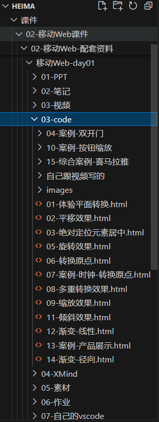
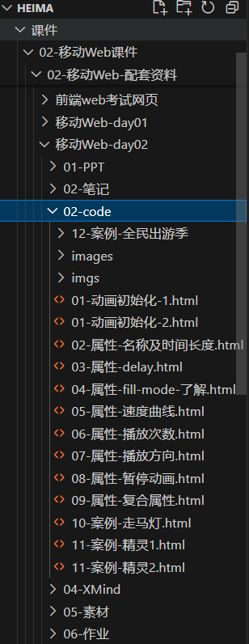
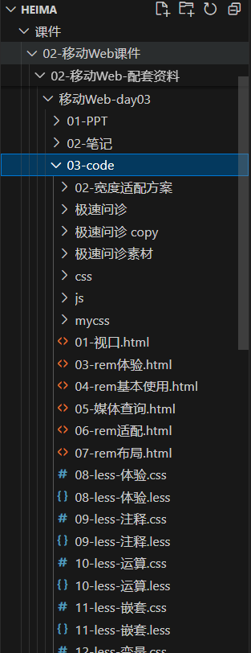
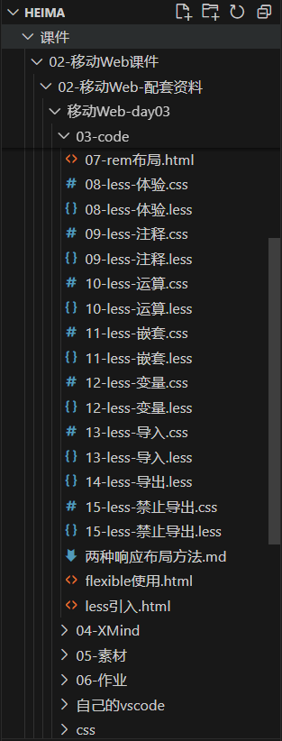
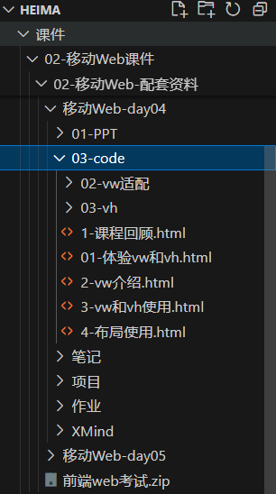
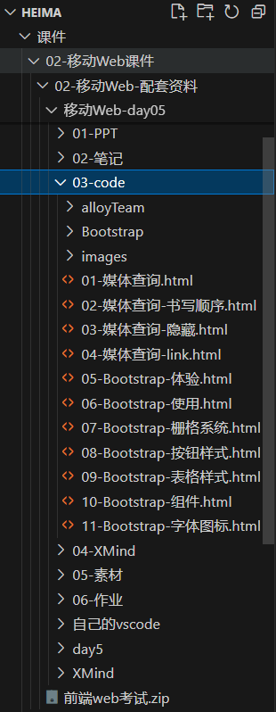

## heima 02-移动Web课件
02-移动Web课件 这几天一共讲了什么

### 移动Web-day01
讲了一些 html5 +css3的缩放 渐变 旋转 3d 复合属性

还包括了一些项目

### 移动Web-day02
第二天讲了动画的属性和项目

### 移动Web-day03
第三天将移动端适配 less flexible插件

给出的移动端适配方案有

1. 百分比适配💩

2. vw + flexible插件方案

vw计算方式: 网页宽度/设备视口宽度 / 100 = 变量

最终结果: (元素 * 变量)

该方案需要一个个元素改 量大不说而且容易错 最终也是废弃了💩

自研方案(快速将px单位转为vw单位)⭐

使用 postcss-px-to-viewport 插件 有两种使用方式

3. 使用nodemoningshipei项目(node.js)⭐

先将less 转为 css 正常的步骤

然后使用插件把css 转为 vwcss文件夹

该文件夹存放的都是 文件名vw.css 文件 里面都是转换好的vw单位

4. 更高级的方式是使用webpack打包 也是使用该插件 适合大型项目

目前不搞了 上面那个够用 以后有时间研究🔧

#### 还有两个插件待研究🔧
postcss-px2vw 也是将px转为vw(备用方案)

postcss-pxtorem 除了将px转为vw 还可以将px转为rem单位 💩
(对于一些需要兼容老版本浏览器的项目,使用 rem 可能会更合适)

## 移动Web-day04
使用第二种适配方案的项目 酷我ing、bilibili项目

## 移动Web-day05
bootstrap的使用

alloyTeam项目(手势插件的运用) 可以监听左滑右滑事件

## 移动Web - day01
{width="250px"}

## 移动Web - day02
{width="250px"}

## 移动Web - day03
{width="250px"}

{width="250px"}

## 移动Web - day04
{width="250px"}

## 移动Web - day05
{width="250px"}