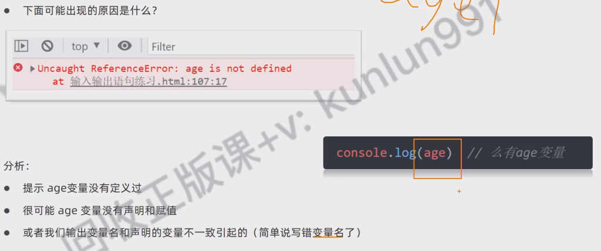
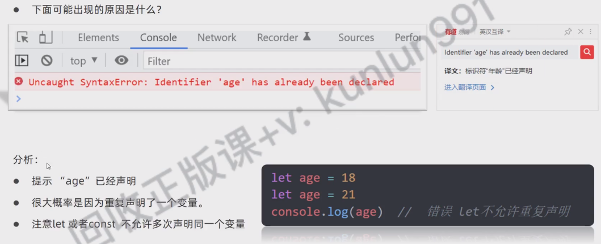
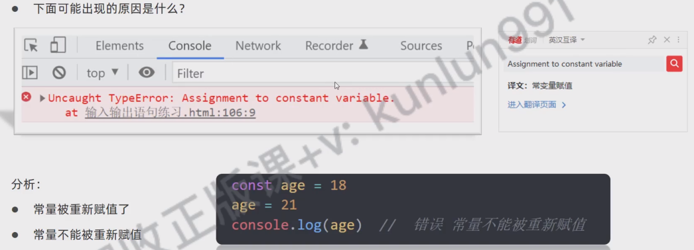

## bug

##  const必须有赋值操作
Uncaught SyntaxError: Missing initializer in const declaration
const age
console.log(age) // 错误

Missing initializer in const declaration
译文：const声明中缺少初始化式

##  没有age变量★
Uncaught ReferenceError: age is not defined
at输入输出语句练习。htm1:187:17
console.log(age) // 

分析：
提示age变量没有定义过
很可能age变量没有声明和赋值
或者我们输出变量名和声明的变量不一致引起的（简单说写错变量名了）

## 错误Let不允许重复声明
Uncaught SyntaxError:Identifier 'age'has already been declared
Identifier 'age'has already been declared
译文：标识符年龄已经声明

let age 18
let age 21
console.log(age) // 

提示“"age”已经声明
很大概率是因为重复声明了一个变量。
注意let或者const不允许多次声明同一个变量

## 常量被重新赋值了
Uncaught TypeError:Assignment to constant variable
Assignment to constant variable
译文：常变星被赋值

常量不能被重新赋值

const age 18
age 21
console.log(age)//错误常量不能被重新赋值

## 栈溢出错误

## js功能失效 缺失
可能是漏写了什么 或者有逻辑漏洞
