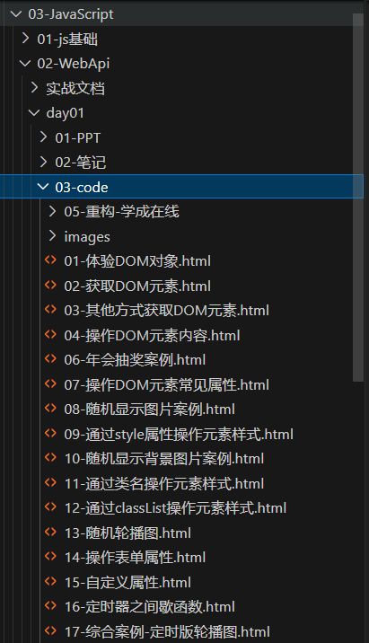
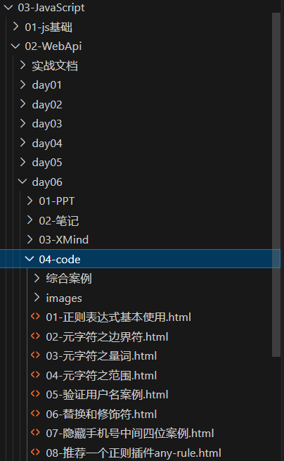

# javascript - js基础

## javascript - js基础 - day01
{width="250px"}

## javascript - js基础 - day02
{width="250px"}

## javascript - js基础 - day03
{width="250px"}

## javascript - js基础 - day04
{width="250px"}

## javascript - js基础 - day05
{width="250px"}

## javascript - js基础 - day05
JS基础编程题 有必要刷
{width="250px"}

## javascript - WebApi - day06
学成在线 渲染
{width="250px"}

## javascript - WebApi - day07
tab栏切换 排他思想 轮播图完整版
{width="250px"}

## javascript - WebApi - day08
小兔鲜案例 做电梯导航的
{width="250px"}

## javascript - WebApi - day09
通讯录案例 是做dom盒子的渲染 新增 删除的
{width="250px"}

## javascript - WebApi - day010
学生统计表 dom盒子的渲染 新增 删除的 还有本地存储
{width="250px"}

## javascript - WebApi - day011
综合案例 表单验证 存本地存储(登录判断)
{width="250px"}