## 运算符优先级
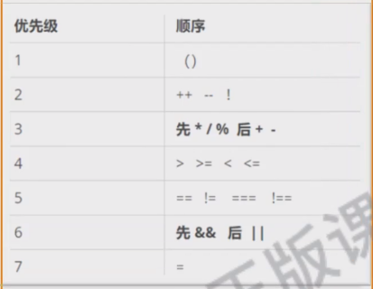

## 类型转换函数 分支语句
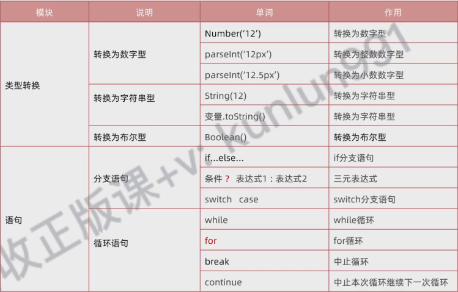

## 数组方法
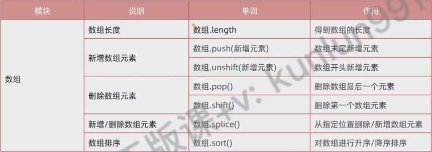

## 断点调试 进入函数内部
F10 是不进入函数的

F9 和 F11 可以

## 作用域
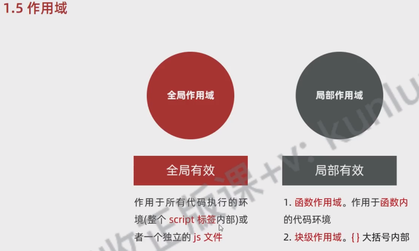

## 匿名函数
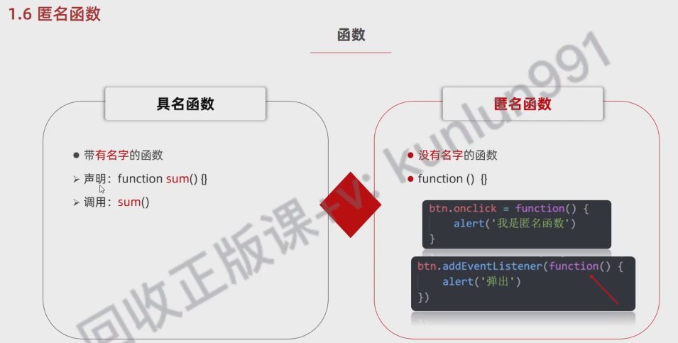

## 删除多余的变量 简化代码
修改前
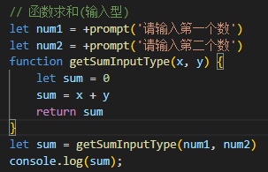
修改后 去除了sum这个变量 直接返回一个表达式
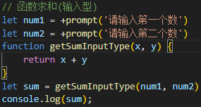

修改前
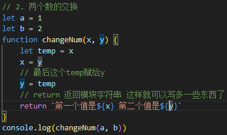
修改后 这里删除了一些变量 将变量放在了调用函数上
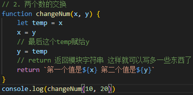

## 优化代码
- 两个if优化 还是flag
- if...else优化成 三元表达式
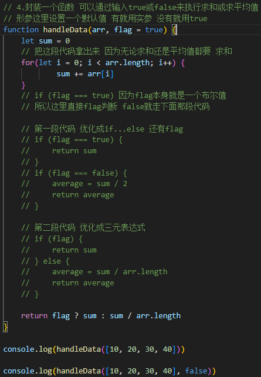

## 设立判断、退出、return...条件的技巧
同时还要注意像这种括号和中括号多的语句 任意出现bug
需要多多检查

console.log(every([10, 20, 30, 4, 5], 10))
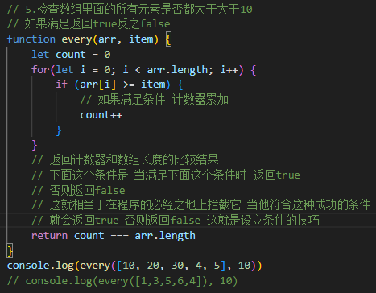

## 什么是对象
后面那一个是匿名函数
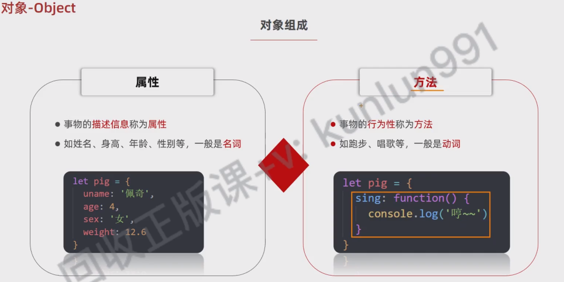

## 如何遍历对象
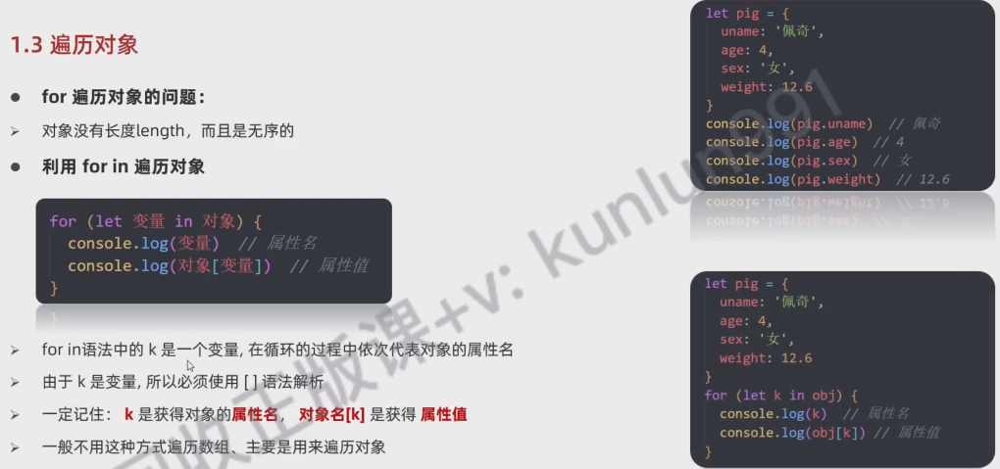

## 内置对象
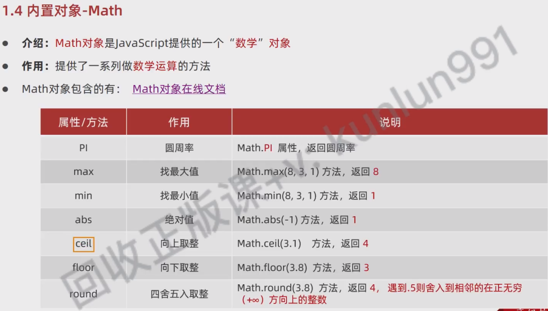

