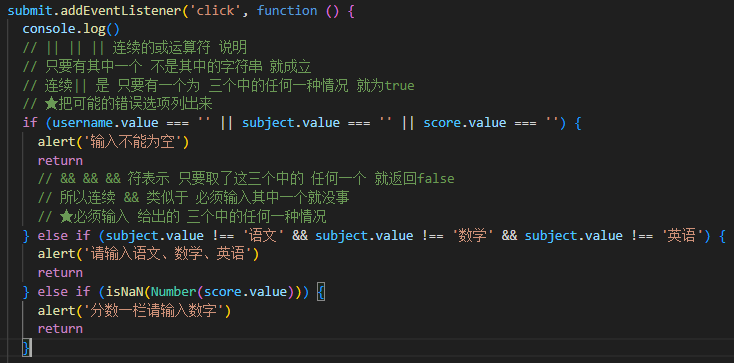

## forEach和map的区别
使用 forEach 当你想对每个元素执行一些操作，但不需要返回新数组时。
使用 map 当你想变换元素并创建一个包含这些变换元素的新数组时。

::: details Click me to view the code
```js
let str = '';  
arr.forEach(function (ele, index) {  
    str += `  
     <div class="item">  
      <p class="circle">${ele.name.substring(ele.name.length - 1)}</p>  
      <p class="name">${ele.name}</p>  
      <p class="tel">${ele.tel}</p>  
      <a class="del" href="javascript:;" >  
        <i class="iconfont icon-shanchutianchong" data-index="${index}"></i>  
      </a>  
    </div>  
    `;  
});
```
:::

::: details Click me to view the code
```js
const strArray = arr.map(function (ele, index) {  
    return `  
     <div class="item">  
      <p class="circle">${ele.name.substring(ele.name.length - 1)}</p>  
      <p class="name">${ele.name}</p>  
      <p class="tel">${ele.tel}</p>  
      <a class="del" href="javascript:;">  
        <i class="iconfont icon-shanchutianchong" data-index="${index}"></i>  
      </a>  
    </div>  
    `;  
});  
const str = strArray.join(''); // 将映射得到的元素连接成一个字符串v
```
:::

## className直接覆盖类名 classList在后面添加类名

## 短路与 和 短路或

### 单个使用
其实就是一个控制条件

&& 为true跳右 反之不进(不执行右边代码)

|| 为false跳右 反之不进(不执行右边代码)

### 连续 || && 说明


## Promise对象深层数组 遍历解构模板 + 变量${}符号内遍历返回
::: details Click me to view the code
```js
const p = Promise.all(twoList);  

p.then(resArr => {  
  // 提取所需数据，同时避免重复操作  
  document.querySelector('.item ul').innerHTML = resArr.map(item => {  
    const { name, children } = item.data.data; // 解构出城市名称和子元素  
    
    return `  
      <div class="item">  
        <h3>${name}</h3>  
        <ul>  
          ${  
            // 对儿童数组进行映射并返回列表项  
            children.map(ele => {  
              const { id, name, picture } = ele; // 解构每个儿童的属性  
              return `  
                <li>  
                  <a href="javascript:;">  
                      
                    <p>${name}</p>  
                  </a>  
                </li>  
              `;  
            }).join('') // 将数组转为字符串  
          }  
        </ul>  
      </div>  
    `;  
  }).join(''); // 将所有列表项连接成单个字符串  
}).catch(err => {  
  // 错误处理  
  console.error(err);  
});
```
:::

## 路径
/ 根目录

./ 当前目录

../ 上一级目录

## 服务器编程 + webapck打包流程⭐
1. 使用nodemoning 做好.html和自定义接口的通信 该任务取消

2. webpacking 打包成dist文件夹 ✅ 打包后用webpack开发服务器测试

3. 将打包好的dist放进 nodefinish的public文件夹中 再使用nodemon测试自定义接口 该任务取消

## 给启动服务器的这个项目 更换样式
待做 

问题有 edge可以跳移动端 但是没有样式

而chrome无法跳移动端🔧
