## 小兔鲜 头部导航栏吸顶效果
下图所示的红线距离就是 xtx_header.offsetTop 是头部盒子到页面顶部的距离 
而n的页面卷去距离的实时变化 当卷曲的距离超过这个红线距离的时候 就会出现吸顶效果
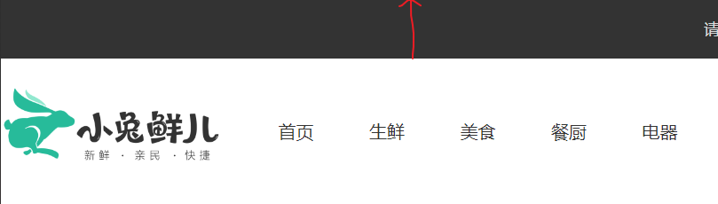

## biliili a标签下方小红线效果
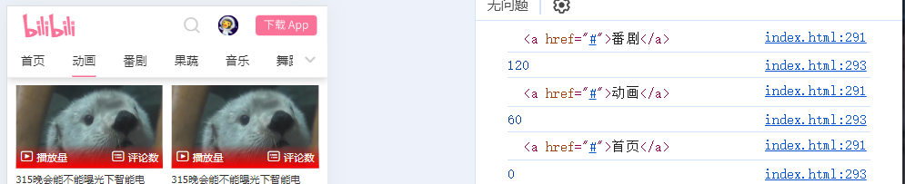

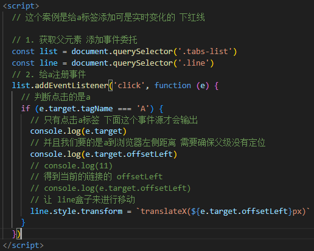

## 电梯导航效果(很细)
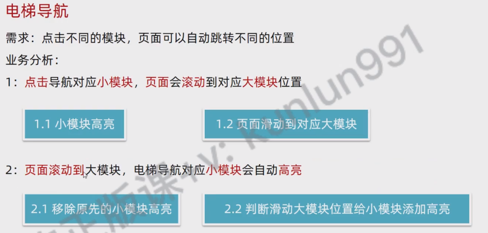

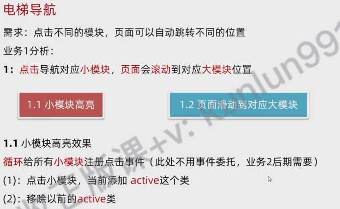
点击电梯导航 跳转到对应位置

这个消除高亮效果也是类似下面的第一次清除 是为了确保没有效果生效前 导航栏没有被高亮过
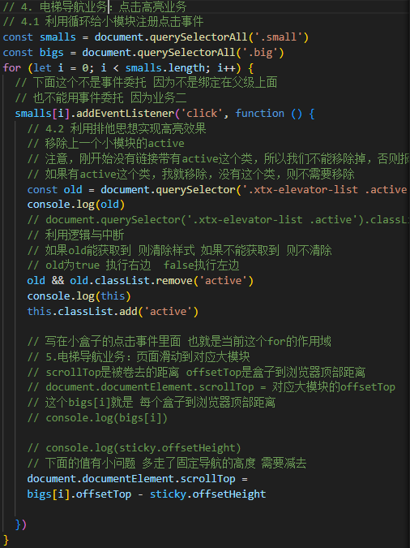
这个写在页面滚动事件里 当滚动到一定距离触发
当到了一定的位置 先清除之前的高亮效果 确保没有高亮效果

然后高亮电梯导航的小模块 同时清除高亮效果 不然就会永久高亮 这样会把所以都点亮 所以需要清除

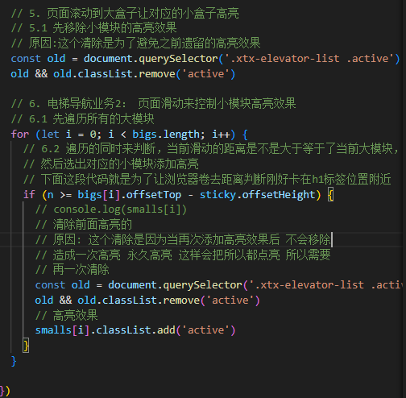

## 购物车加减案例
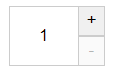

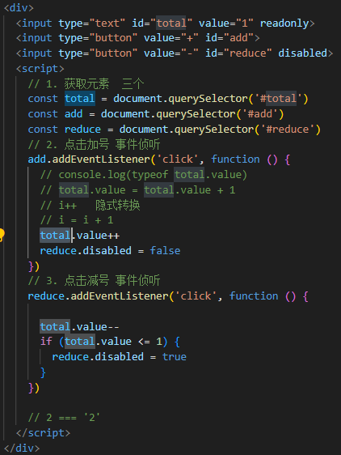

## 倒计时效果

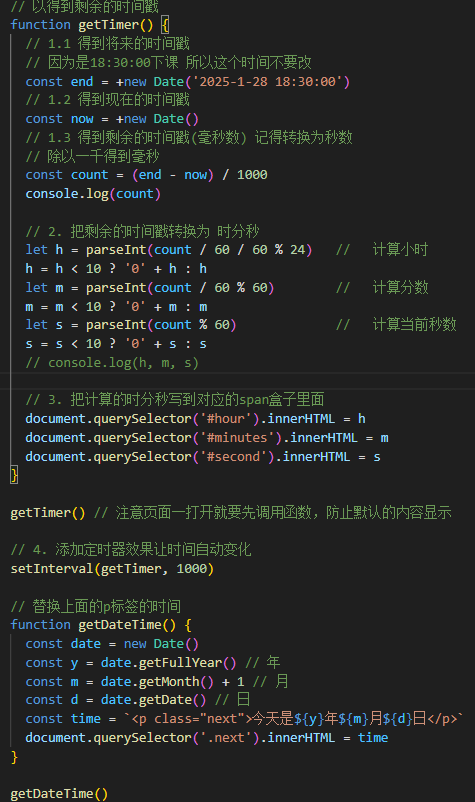

## 点击按钮几秒后关闭广告
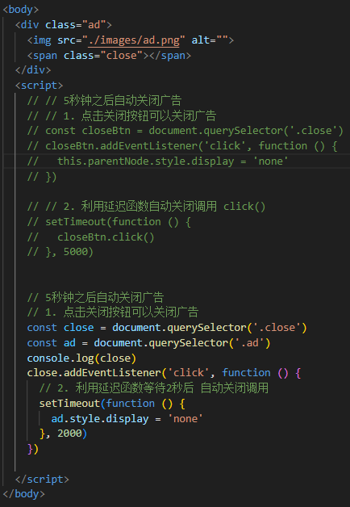

## 点击按钮5秒后跳转
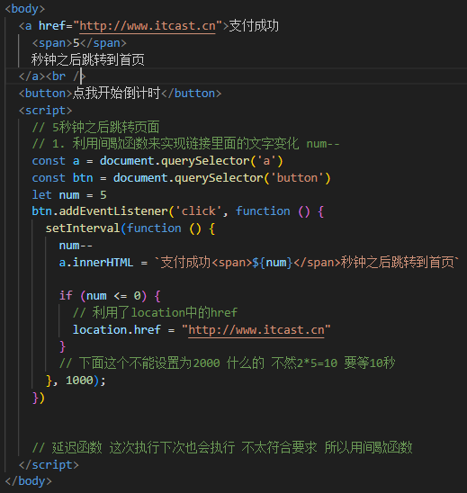

## 本地存储 渲染dom增删改查 ...

## 小兔鲜验证案例 密码验证
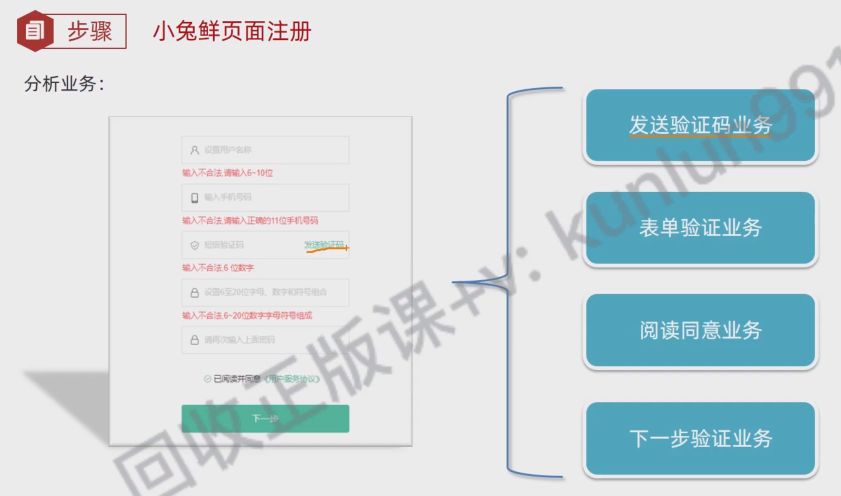

## 小兔鲜登录进去换登录按钮
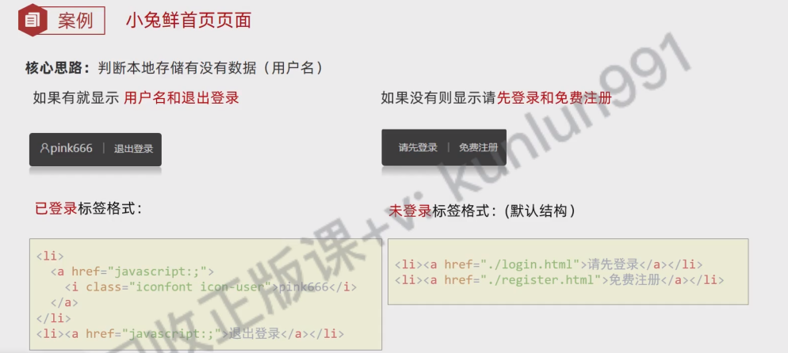