## 什么是Webpack
是一个用于JS应用程序的静态模块打包工具

将多个文件整合成一个文件

比如两个js合成一个 三个sass合成一个css

两张图片合不来 拿出来 放一边
{width=600px}

### 场景
比如一个项目中有很多css 和 bootstrap的css(依赖项)

这时就要合成为一个css 上线需要

### 入口
入口就是和某一个.html文件有关系的 就会被打包 没关系的不会打包

什么是和入口没关系

比如index.html 引用了 index.css

indextwo.html 引用了 login.js

如果此时indextwo.html被删除 那么login.js也就失去了引用的必要性

这个index.html就是入口

而引用的check.js也会被引用

而出口就是dist文件夹下的main.js
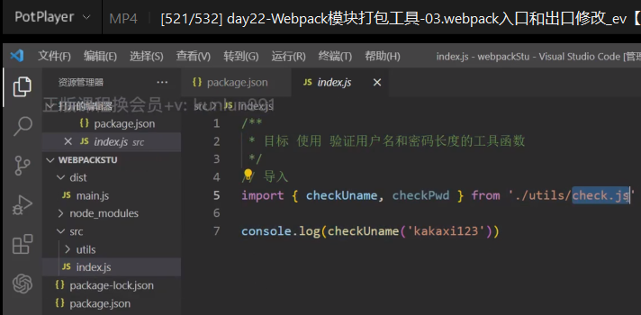{width=600px}

### 其他概念
浏览器不认识less/sass代码 所以要转成css 代码 
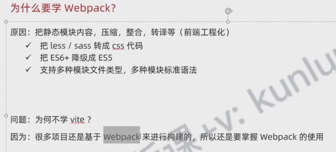{width=600px}

### 实操
使用局部命令 区别于nodemon 需要配置scripts

run表示执行局部命令 bulid依然执行scripts里面build命令

如果项目要上线了 我就把dist文件夹 给他

流程:把check.js 和 index.js 交给Webpack 最后得到 dist文件夹
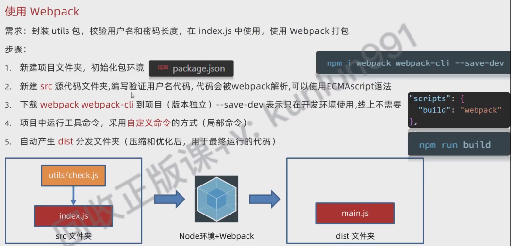{width=600px}

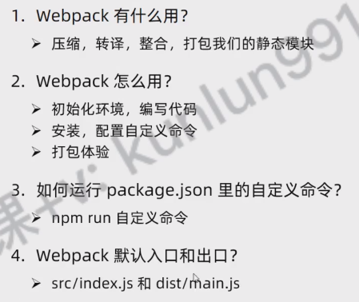{width=600px}

## Webpack的基本使用
初始化不要用非英文名 还有不要使用Webpack和工具名称和保留字

建立src文件夹 下有uilts 和 index.js文件

uilts下有check.js 被 index.js引用

初始化后使用npm i webpack webpack-cli --save-dev命令

获得node_modules

package.json中配置 scirpts下的"build": "webpack"命令

执行npm run build命令 获得 dist文件夹下的 main.js

## 修改webpack打包入口和出口
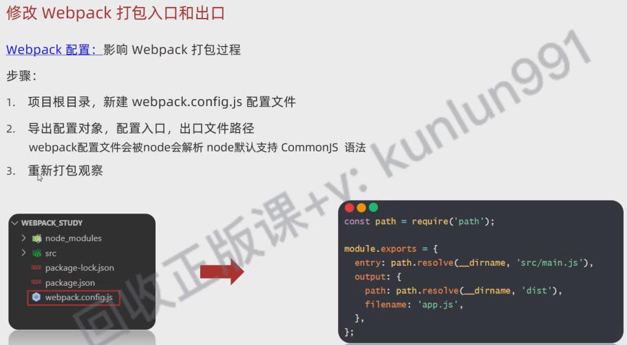{width=600px}

## 注册用户 - 长度判断
一般的方法 只打包的js html的手动丢进去的 不推荐

打包后再把 index.html复制到dist下

在index.html引入打包后的app.js后

在index.html中引入app.js试运行
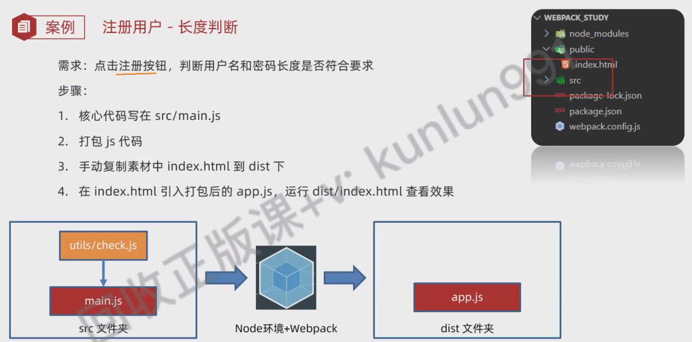{width=600px}

## 自动生成html文件
重新生成app.js的时候发现index.html会没

让webpack自动帮我生成html

帮我们自动引入app.js

默认情况下 webpack 是不认识 html 文件的
所以我们要让webpack认识html文件 所以引入一个插件
### 插件的作用
这个插件的作用就是会自动帮我们 

生成一个简单html页面并且引入js

然后我们还可以配置html模板 让它以我们配置的html模板生成html页面
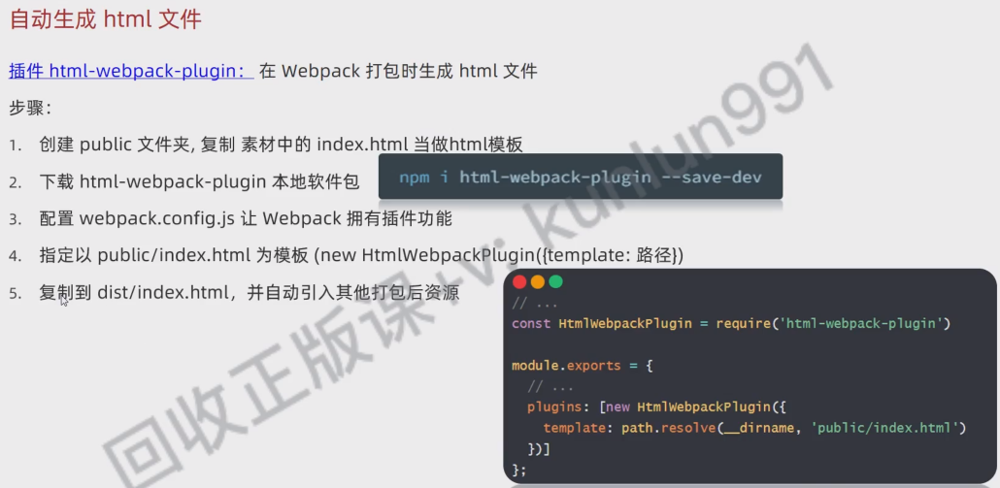{width=600px}

## 打包css模块
webpack是只认识js和json文件内容的

不认识css html 等

所以需要加载器让它认识

这里第一次生成后 会发现html中没有引入css模块
但是却有css 这时因为css在js(main.js)中引入了
所以css在js中
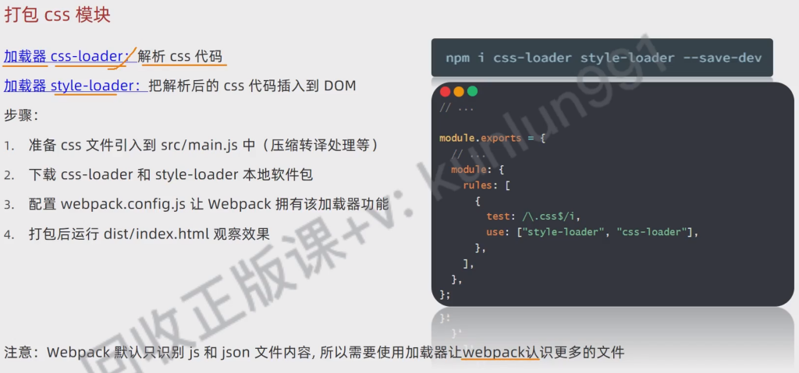{width=600px}

## 打包less模块
webpack也不认识less 所以需要加载器

目标: 让 webpack 解析 less文件
 * 1. 在入口中 引入less文件
 * 2. 下载less和less-loader
 * 3. 配置webpack.config.js
 * 4. 重新打包


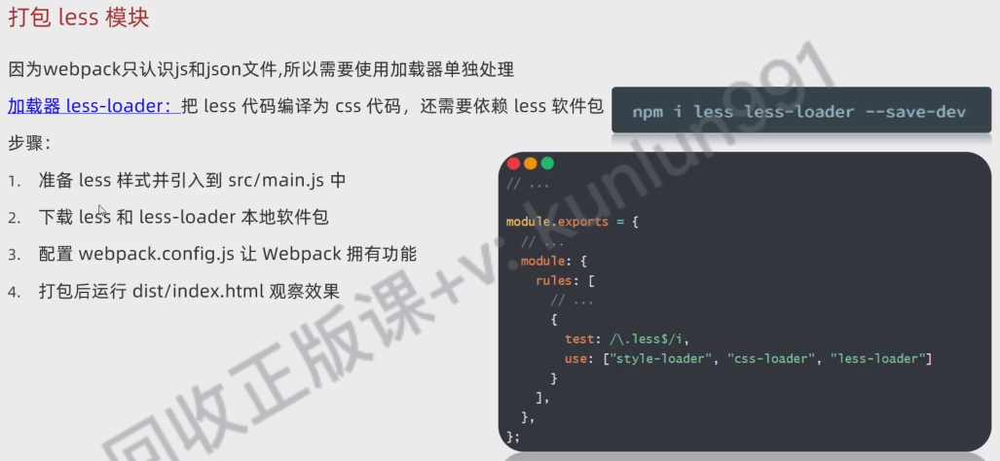{width=600px}

## 打包图片
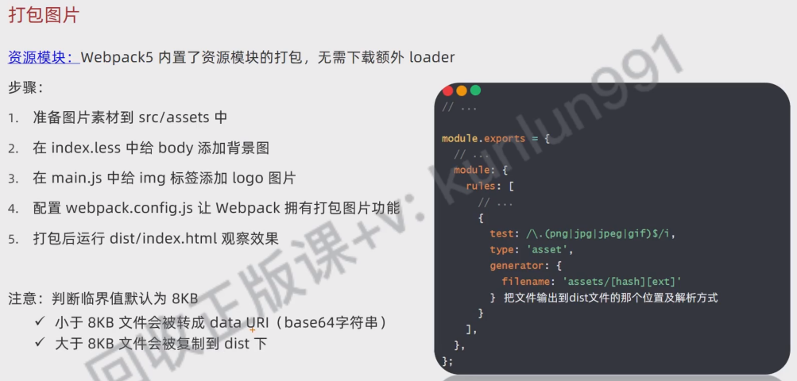{width=600px}

## babel编译器(降低版本)
js语法编译器

采用ECMAScript 2015+ 语法编写代码

转换js代码版本 比如：ES6+ => ES5

比如：低版本浏览器不支持ES6写法

如果我们用到了ES6语法 比如箭头函数

就不能生效 所以使用babel编译器就可以把版本变低

流程：
1.  写一段箭头函数

2.  下载三个babel包

3.  配置webpack

4.  打包运行 看效果
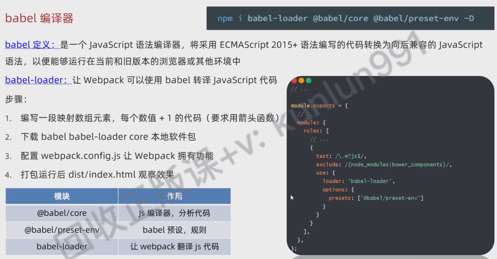{width=600px}

-D 是什么意思呢 --save-dev 的缩写

## .mjs 和 .js文件的区别
这两句话对吗
// js 默认支持 CommonJS规范
// mjs 默认支持 ECMAScript规范
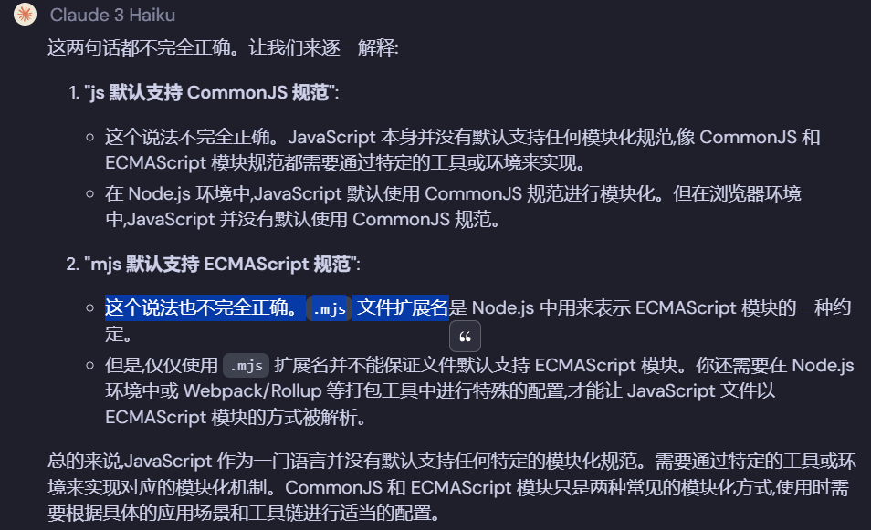{width=600px}

## 项目上线后不加--save-dev / -D
上面的devDependencies是 开发环境下的以来

dependencies是非开发环境下的依赖 也就是上线后也要用
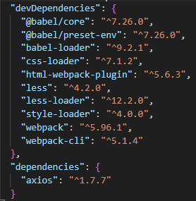{width=300px}

## 引入axios
注意控制台打印出了
```js
ƒ (){return e.apply(t,arguments)}
```

说明引入了axios
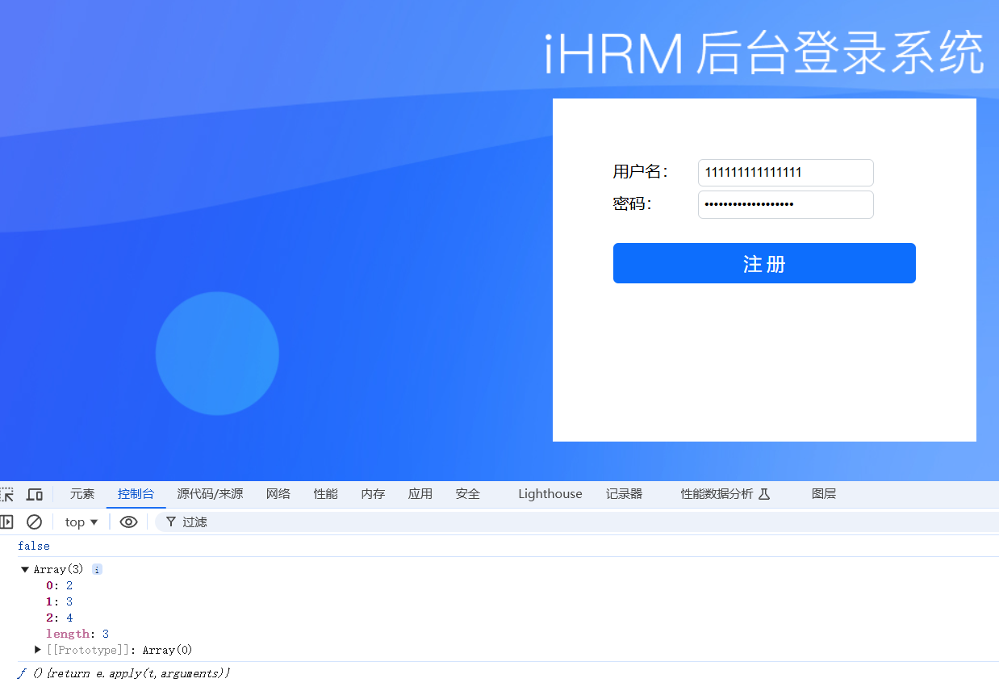{width=600px}

引入axios代码 直接下载的 也是直接使用 不用写路径

最后使用axios成功获取到了数据 说明这一部分都是可以 

抽离出去 封装成一个单独模块 让入口文件main.js更简洁
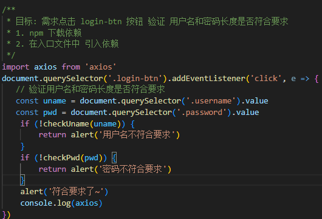{width=600px}

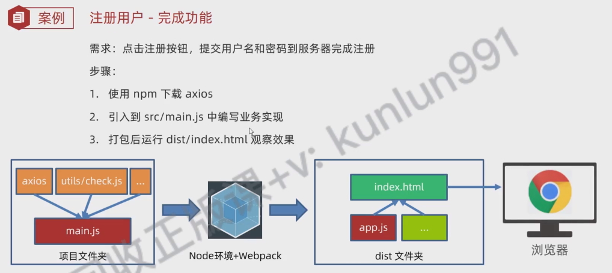{width=600px}

## Webpack 开发服务器
帮我们自动打包 不用每次都手动启动服务 还会热更新

更新命令 然后使用npm run dev 启动服务器

这个命令没有打包 监听了一下入口文件有没有改变 

有改变 就启动虚拟服务器(刷新服务器) 并且编译新的结果

监听8080端口

```js
"dev": "webpack server --open --mode=development"
```

编译完没有帮我们自动打开服务器 所以加上--open 

编译完自动打开服务器

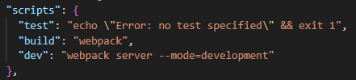{width=600px}

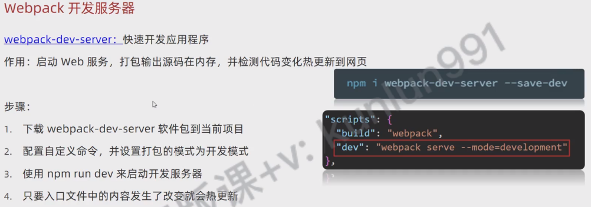{width=600px}

## 打包模式
有两种开发模式 和 生产模式 两种模式
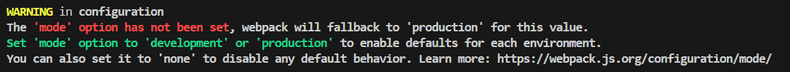{width=600px}

上图中没加 模式 所以出现mode错误 而现在

在build中加上 --mode=production后就不会有 上面的mode错误了

🐵生产模式
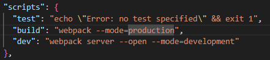{width=600px}

打包后的app.js
--mode=production模式下的app.js
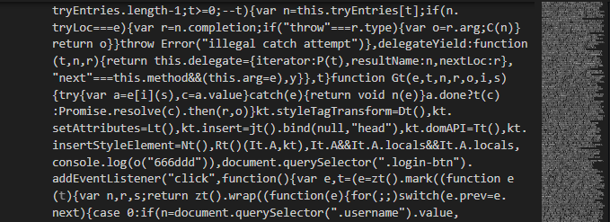{width=600px}

控制台输出
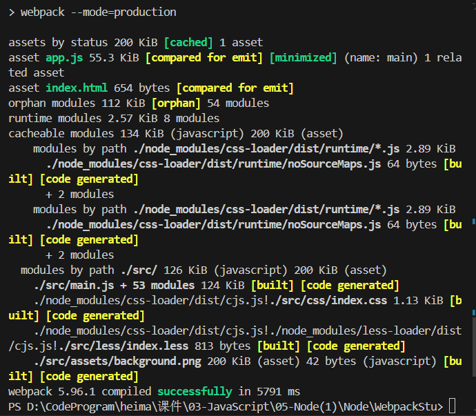{width=400px}

发现两种模式下的app.js不一样

🐵开发模式
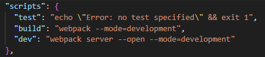{width=600px}

打包后的app.js
--mode=development模式下的app.js
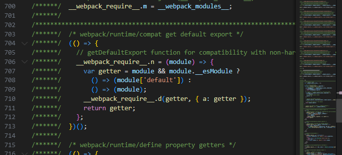{width=600px}

开发模式下使用development(没压缩 实时刷新)

生产(上线)模式下使用production(更轻)

注意 优先使用命令行设置 在scripts中的
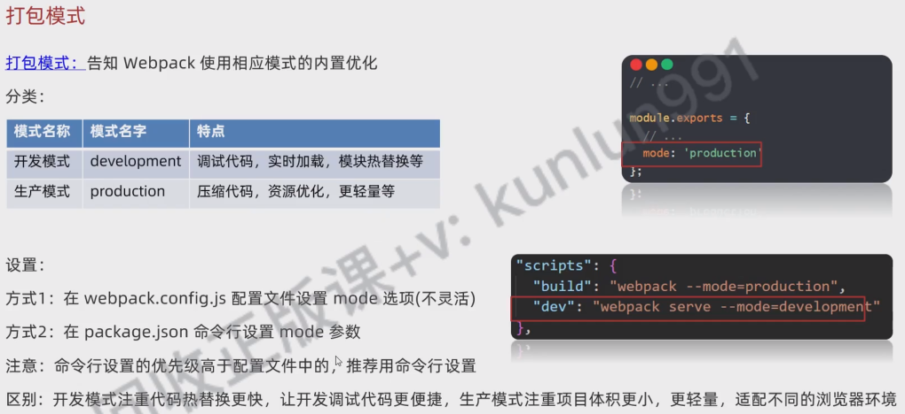{width=600px}

## 开发环境调错 - source map
首先准备一个必然的错误 比如.username111
就会获取不到标签

然后执行npm run dev 启动服务器
注意是启动服务器 不是npm run build去打包
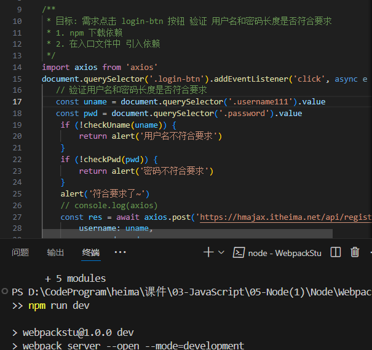{width=600px}

输入框输入后报错 然后点击右下角的main.js查看出错位置
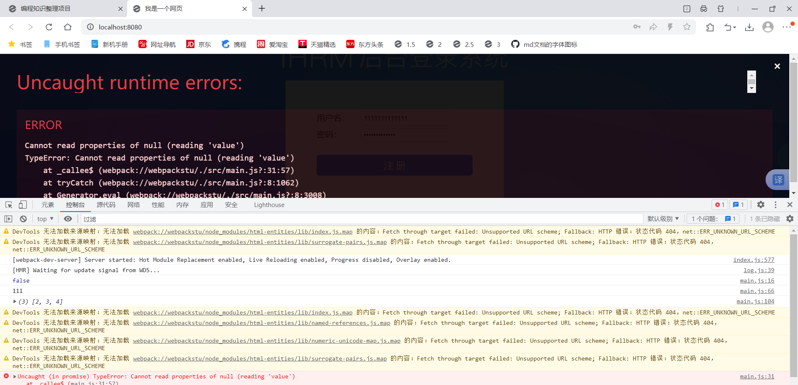{width=600px}

可以看到没有获取到标签导致报错
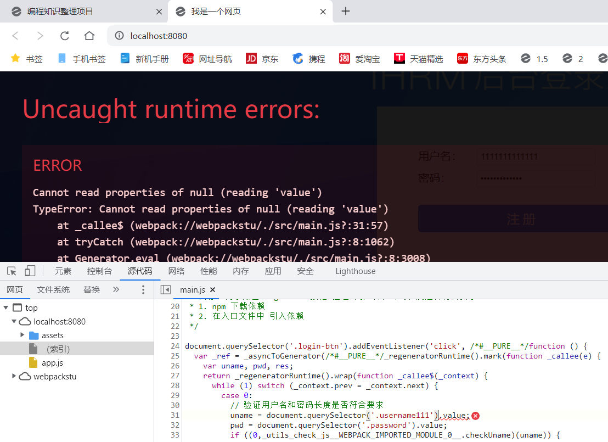{width=600px}

### 当dev 后面改为production时 看不出错误位置的场景 
因为代码被压缩了 所以报错位置看不出

启动npm run dev 后 可能报错位置看不出来
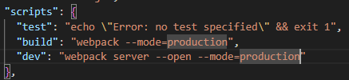{width=600px}

可以看到右下角的app.js报错居然显示 app.js:2

第2行显示不对 所以我们需要一个报错工具
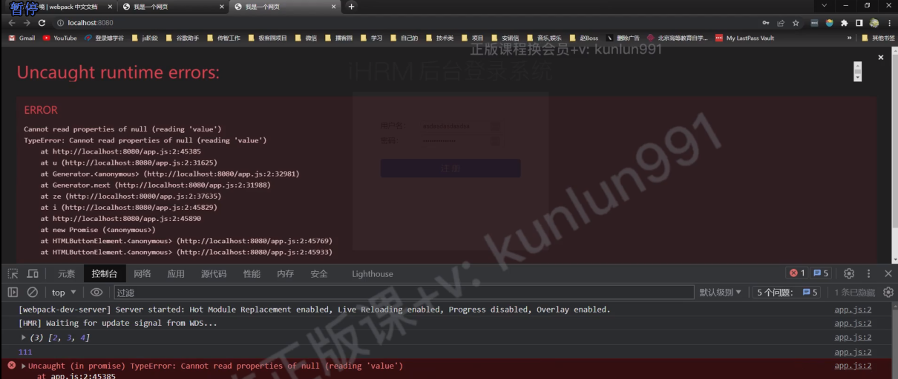{width=600px}

这个报错工具 仅适用于开发环境 

上线就不用了 因为别人可以看到我的代码

而学过前端的打开控制台一看就能知道错误位置 所以不太好

所以仅用在开发环境 上线就别用这个 bug查找器了

### bug查找器
使用前提 dev设置为开发模式
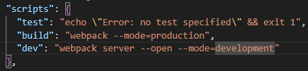{width=600px}

此时就能发现 main.js:17 的精确错误显示了
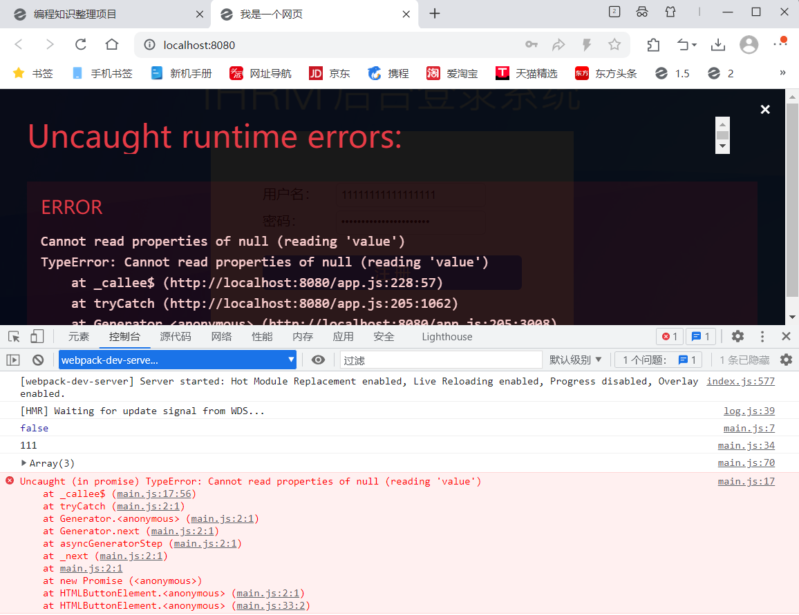{width=600px}

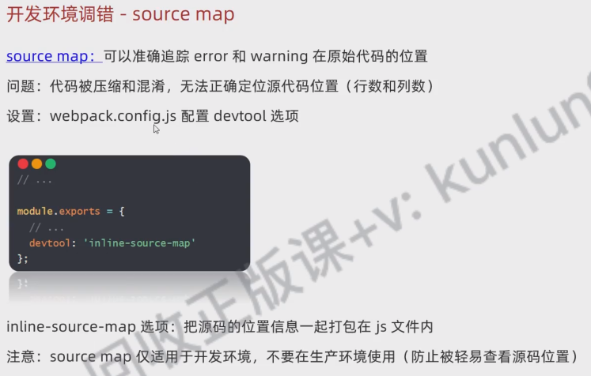{width=600px}

## 解析别名 用别名替换路径多余的字符
../ ./ 多余 要替换掉

在webpack.config.js中配置别名
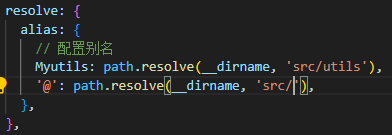{width=600px}

原本是
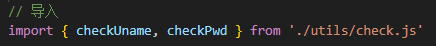{width=600px}
配置后

写成Myutils变量名
{width=600px}

@符替换前 是./
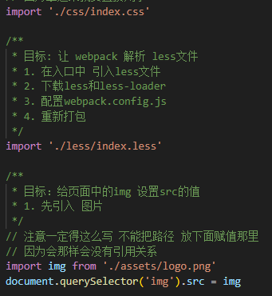{width=400px}

替换后是 @ 不用写/ 已经在定义中写了
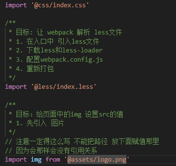{width=400px}

在main.js中遇到别名 就会去webpack.config.js中查找别名

然后就会拿到别名后面的路径 去做处理
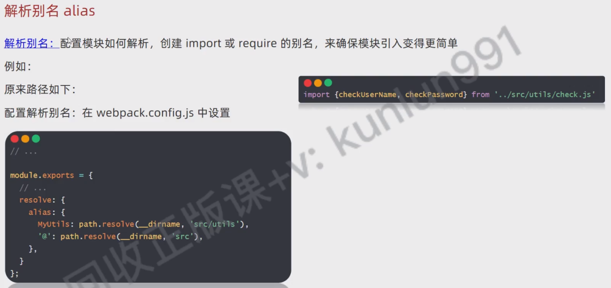{width=600px}


