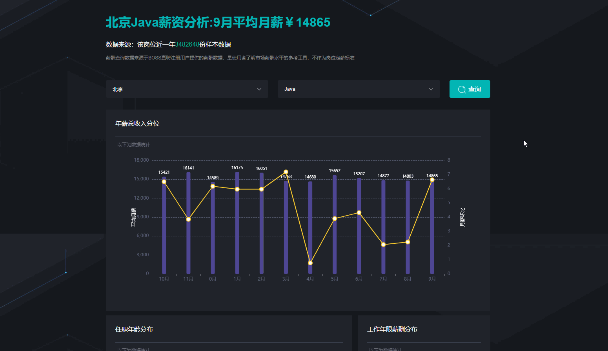
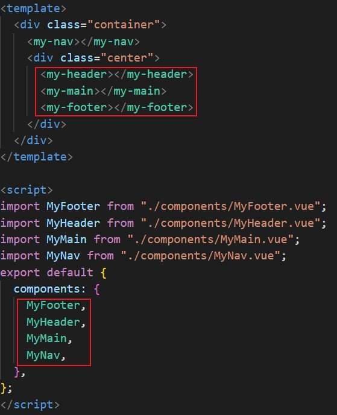

# 今日能力目标：

掌握生命周期各个阶段的作用，使用脚手架进行工程化开发，了解组件化发开以及如何注册组件

**必要知识：**

1. 能够说出**生命周期**各个阶段执行内容
2. 能够使用**脚手架**创建并运行项目
3. 能够**注册**并**使用**组件

# 一. 编程题

## 1. BOSS直聘薪资分析-综合实战

**难度等级：**`★★★★`

**作业目标：**完成BOSS直聘薪资分析页面开发

**考察能力：**

1. 能够在对应的生命周期进行接口调用和图表渲染
2. 能够根据接口文档进行接口调用及数据渲染
3. 能够将接口数据格式转化成图表所需格式

### 1.1 作业需求

**效果图需求如下：**(根据提供的素材，完成该页面的数据渲染、图表渲染和查询功能)

 

**具体需求如下：**

- 城市下拉列表
  - 调用后台项目提供的接口，**获取**城市列表数据并**渲染**对应下拉位置
  - 点击城市下拉选项，可以**切换**城市
- 职位下拉列表
  - 调用后台项目提供的接口，**获得**职位列表数据并渲染对应下拉位置
  - 点击职位下拉选项，可以**切换**职位
- 点击查询
  - **点击**查询按钮，根据所选择的城市和职位**查询**薪资分析信息
  - **更新**页面的**简介**信息，包含：**城市**、**薪资**、**时间**、**平均薪资**、**样本数据数量**,5处内容
  - **更新**页面的**图表**信息，包含：**线图**、**饼图**、**柱图**、**地图**4个图表
- 首次加载
  - 首次打开加载北京Java的薪资分析，展示该城市职位的**简介信息** 和 **图表**

### 1.2 相关素材

- 后台启动指令：`npm run start`
- 项目文件见素材
- 接口文档见素材
- chart图配置示例见素材


### 1.3 思路分析

- 职位下拉列表
  - 调用后台项目提供的接口，**获得**职位列表数据并渲染对应下拉位置
  - 点击职位下拉选项，可以**切换**职位
- 点击查询
  - **点击**查询按钮，根据所选择的城市和职位**查询**薪资分析信息
  - **更新**页面的**简介**信息，包含：**城市**、**薪资**、**时间**、**平均薪资**、**样本数据数量**,5处内容
  - **更新**页面的**图表**信息，包含：**线图**、**饼图**、**柱图**、**地图**4个图表
- 首次加载
  - 首次打开加载北京Java的薪资分析，展示该城市职位的**简介信息** 和 **图表**

### 1.4 参考答案

**见附件**

### 1.5 总结反馈

- [ ] 我看效果图就可以独立完成
- [ ] 我需要看思路分析才能完成
- [ ] 我需要看参考答案才能完成
- [ ] 没有思路自己无法完成

## 2. Saas系统布局-变形题

**难度等级：**`★★`

**作业目标：**制作开发中常见的电影详情页面

**考察能力：**

1. 能够选择合适的标签搭建页面结构
2. 能够通过**相对路径**在页面中插入图片和视频
3. 能够使用**图片属性**设置图片大小并制定提示文本和替换文本

### 1.1 作业需求

**效果图需求如下：**（请注册自定义组件实现布局效果）

 

**具体需求如下：**

- 通过脚手架创建项目`saas-project`
- 注册自定义组件`MyNav`
  - 如图所示，位于页面左侧
  - 背景色为`hotpink`
  - 高度自适应，宽度`200px`

- 注册自定义组件`NavItem`
  - 如图所示，位于`MyNav`组件中
  - 背景色为`orange`
  - 高度`60px`，高度自适应
  - 底边`1px solid #fff`

- 注册自定义组件`MyHeader`
  - 如图所示，位于页面上侧
  - 高度`60px`,宽度自适应
  - 背景色为`pink`

- 注册自定义组件`MyMain`
  - 如图所示，位于页面中间
  - 高度自适应，宽度自适应
  - 背景色为`lightblue`

- 注册自定义组件`MyFooter`
  - 如图所示，位于页面底部
  - 高度`80px`，宽度自适应
  - 背景色为`pink`

- 通过自定义组件进行布局实现页面效果


### 1.2 相关素材

无

### 1.3 思路分析

- 创建项目

  - 使用 `npm create saas-project`创建项目，选择`vue2`版本，注意项目所在路径不能出现中文，否则启动有可能会报错

- 注册**自定义**组件`MyNav`

  - `components`文件夹创建`MyNav.vue`文件
  - 生成默认`vue`模版
  - `template`中生成类名为`nav`的`div`
  - 设置样式`width:200px`,`background-color: hotpink`
  - 在`App.vue`中导入`MyNav`组件，使用`components`属性局部注册
  - 页面使用`<my-nav></my-nav>`或者`<MyNav></MyNav>`使用组件

- 注册**全局自定义**组件`NavItem`

  - `components`文件夹创建`NavItem.vue`文件
  - 生成默认`vue`模版
  - `template`中生成类名为`nav-item`的`div`
  - 设置样式`height:60px`,`background-color: orange`,`border-bottom: 1px solid #fff`
  - 在`main.js`中导入`NavItem`组件，使用`Vue.component('NavItem',NavItem)`全局注册组件
  - 在`App.vue`中使用`<nav-item></nav-item>`或者`<NavItem></NavItem>`使用组件

- 注册**自定义**组件`MyHeader`

  - `components`文件夹创建`MyHeader.vue`文件
  - 生成默认`vue`模版
  - `template`中生成类名为`header`的`div`
  - 设置样式`height: 60px`,`background-color: pink`
  - 在`App.vue`中导入`MyHeader`组件，使用`components`属性局部注册
  - 页面使用`<my-header></my-header>`或者`<MyHeader></MyHeader>`使用组件

- 注册**自定义**组件`MyMain`

  - `components`文件夹创建`MyMain.vue`文件
  - 生成默认`vue`模版
  - `template`中生成类名为`main`的`div`
  - 设置样式`flex: 1`,`background-color: lightblue`
  - 在`App.vue`中导入`MyMain`组件，使用`components`属性局部注册
  - 页面使用`<my-main></my-main>`或者`<MyMain></MyMain>`使用组件

- 注册**自定义**组件`MyFooter`

  - `components`文件夹创建`MyFooter.vue`文件
  - 生成默认`vue`模版
  - `template`中生成类名为`footer`的`div`
  - 设置样式`height:80px`,`background-color: pink`
  - 在`App.vue`中导入`MyFooter`组件，使用`components`属性局部注册
  - 页面使用`<my-footer></my-footer>`或者`<MyFooter></MyFooter>`使用组件

- 页面布局

  - 创建`style`文件夹并生成`index.css`文件

  - 进行`css`样式初始化，清空默认的`margin，padding`，设置`html，body`宽高为100%

    ```css
    *{
        margin: 0;
        padding: 0;
    }
    html,body{
        width: 100%;
        height: 100%;
    }
    ```

  - 在`main.js`使用`import "./style/common.css"`中导入`css`文件，加载样式

  - 在`App.vue`中，设置根节点`div`宽高为`100%`，并开启`flex`布局

  - 先放`MyNav`组件，后放类名为`center`的`div`，设置`center`的`flex:1`实现自适应宽高，并开启`flex`,设置`flex-direction: column`

  - 在`center`中依次放入`MyHeader`、`MyMain`、`MyFooter`组件后，布局完成

### 1.4 参考答案

见附件

### 1.5 总结反馈

- [ ] 我能看效果图就可以独立完成电影详情页面
- [ ] 我需要看思路分析才能完成电影详情页面
- [ ] 我需要看参考答案才能完成电影详情页面
- [ ] 没有思路自己无法完成电影详情页面

## 3. 重构百度云盘文件列表-二次开发

**难度等级：**`★★★`

**作业目标：**使用工程化重构百度云盘文件列表项目

**考察能力：**

1. 能够使用脚手架进行工程化项目的创建
2. 能够将`html`、`css`组成的页面抽离成自定义组件并还原页面效果

### 3.1 作业需求

**已有效果**：

 


**需求效果：**

 

**增加需求如下：**

1. 根据提供的素材，将静态的项目重构为**工程化项目**，重构后页面效果与原先保持一致
2. 自定义3个组件`MyHeader.vue`、`MyNav.vue`、`MyContent.vue`，各组件效果如下
   - `MyHeader.vue`
   - `MyNav.vue`
   - `MyHeader.vue`

### 3.2 相关素材

见附件

### 3.3 思路分析

1. 使用`vue create baidu-netdisk`创建vue2项目
2. 在`components`文件夹下分别创建`MyHeader.vue`、`MyNav.vue`、`MyContent.vue`
2. 每个`vue`文件分别从素材中粘贴对应的`html`,`css`代码，粘贴到`template`和`style`中
2. 创建`style`文件夹，文件夹下创建`index.css`,设置`html,body`宽高100%，清除默认`margin`和`padding`,并在`main.js`中引入
3. 在`App.vue`中引入并注册自定义的组件，通过布局样式实现最终效果

### 3.4 参考答案

见素材

### 3.5 总结反馈

- [ ]  我能读懂提供的素材代码，可以完成二次开发课程详情页面
- [ ]  我能读懂提供的素材代码，需要看思路分析才能完成二次开发课程详情页面
- [ ]  我能读懂提供的素材代码，需要看参考答案才能完成二次开发课程详情页面
- [ ]  我看不懂提供的素材代码，没有思路，无法完成二次开发课程详情页面

# 二. 问答题

## 1. Vue的生命周期有哪些？

**难度等级：**`★★`

**考察能力：**

1. 掌握`Vue`的生命周期顺序以及作用
2. 掌握开发中常用的生命周期

### 1.1 问答要点

1. 分别列出`Vue`的8个生命周期以及作用
2. 请求数据和操作`DOM`分别在哪个周期执行？

### 1.2 参考答案

```markdown
生命：
	beforeCreate：在实例初始化之后，数据和事件还没完成
	created：实例创建完成后调用，此阶段完成了数据，属性和方法的运算，以及事件监听
	beforeMount：在挂载dom前被调用，相关的render函数首次被调用
	mounted：挂载到实例上去之后调用该钩子，此时可以对dom进行操作
	beforeUpdate：数据更新时调用，发生在虚拟DOM打补丁之前
	updated：由于数据更改导致的虚拟DOM重新渲染和打补丁，在这之后会调用该钩子。
	beforeDestroy：实例销毁之前调用，在这一步，实例仍然完全可用，可以解绑不必要的事件，定时器等
	destroyed：Vue实例销毁后调用

请求数据和操作dom：
	created已经完成数据和属性还有方法的运算，可以用来发送请求，mounted已经完成了dom的挂载，可以进行dom的操作
```

## 2. 一个自定义`MyParent`组件中，使用了自定义`MyChild`组件，首次渲染这两个组件时，他们的会执行哪些周期，执行顺序是什么？


**难度等级：**`★★★`

**考察能力：**

1. 能够说出组件包含时的生命周期

### 2.1 问答要点

1. 一个自定义`MyParent`组件中，使用了自定义`MyChild`组件，首次渲染这两个组件时，他们的会执行哪些周期
1. 他们的执行顺序是什么？

### 2.2 参考答案

~~~markdown
会执行的周期：
	首次渲染组件，只会执行beforeCreate、created、beforeMount和mouted，所以MyParent组件和MyChild组件只会执行各自的beforeCreate、created、beforeMount和mouted4个生命周期

执行顺序：
	组件渲染是从外往里，所以会优先渲染MyParent组件，就会执行MyParent组件的beforeCreate、created、beforeMount，而mounted周期的执行是需要dom渲染完毕才会执行，其中MyChild组件是包含在MyParent组件中，所以必须先等待MyChild组件渲染完，MyParent才能渲染完，这个时候就会执行MyChild组件的beforeCreate、created、beforeMount和mouted，等待MyChild组件mounted执行了，MyParent组件的mounted才会执行，所以最终执行顺序为：1.MyParent的beforeCreate，2.MyParent的created，3.MyParent的beforeMount，4.MyChild的beforeCreate，5.MyChild的created，6.MyChild的beforeMount，7.MyChild的mounted，8.MyParent的mounted，
~~~

## 3. 在created发请求和在mounted发请求有什么区别？

**难度等级：**`★★★`

**考察能力：**

1. 能够理解两个生命周期的差异

### 3.1 问答要点

1. 在mounted周期发请求，响应的数据绑定到页面上，页面在响应成功时会更新吗？
1. 他们有什么区别？

### 3.2 参考答案

~~~markdown
会更新：
	mounted周期时机是比created时机靠后，所以created能做的事在mounted也能做，比如：发送ajax

区别：
	在mounted周期，dom已经渲染完毕了，此时数据如果还没响应回来，页面可能会出现很多{{表达式}}，等待数据相应后，这些表达式才会被解析为数据，从而更新，页面可能会出现闪烁的情况，所以为了避免这种现象，应当在created周期发送请求，这样渲染的dom就不会再闪烁一次了
~~~


# 三. 自主学习题

## 1. 组件名大小写

**难度等级：**`★`

在项目开发过程中你可能会看到一些组件的注册时使用的大驼峰，但是使用时用的`-`连接，比如：

  

### 1.1 题目要求

查阅 `vue`官方文档，学习`组件注册`中的`组件名大小写`实现如图效果。

### 1.2 参考教程

[Vue官方文档-组件注册#组件名大小写](https://v2.cn.vuejs.org/v2/guide/components-registration.html#%E7%BB%84%E4%BB%B6%E5%90%8D%E5%A4%A7%E5%B0%8F%E5%86%99)

### 1.3 相关素材

在**Saas系统布局-变形题**中实现

### 1.4 参考答案

见素材

### 1.5 总结提炼

* 注册组件：使用首字母大写命名定义
* 使用组件： `<my-component-name>` 和 `<MyComponentName>` 两种都是可以的


# 四、选择题

1. 以下生命周期钩子中，哪个在创建实例时被调用？


   A： created

   B： beforeCreate

   C： mounted

   D： beforeMount

   答案：B

   解析：`beforeCreate` 钩子在实例初始化之后，数据观测和事件配置之前被调用。它是在实例初始化阶段的第一个钩子。

   ​

2. 以下生命周期钩子中，哪个在数据和事件配置之后立即被调用？


   A： created

   B： beforeCreate

   C： mounted

   D： beforeMount

​	答案：A

​	解析：`created` 钩子在实例创建完成后立即被调用。在这个阶段，实例已经完成了数据观测、属性和方法的运算，但还没有挂载到 DOM 上。


   3.在以下哪个生命周期钩子中可以访问当前的 DOM 元素？

   A： created

   B： beforeCreate

   C： mounted

   D： beforeMount

​	答案：C

​	解析：`mounted` 钩子在实例挂载到 DOM 后被调用，此时可以访问当前的 DOM 元素。


  4.以下哪个生命周期钩子中可以对即将销毁的实例进行操作？

   A： beforeDestroy

   B： destroyed

   C： updated

   D： beforeUpdate

​	答案：A

​	解析：`beforeDestroy` 钩子在实例销毁之前被调用，允许在实例销毁之前对其进行一些操作。
