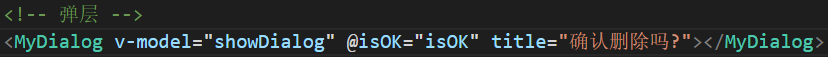
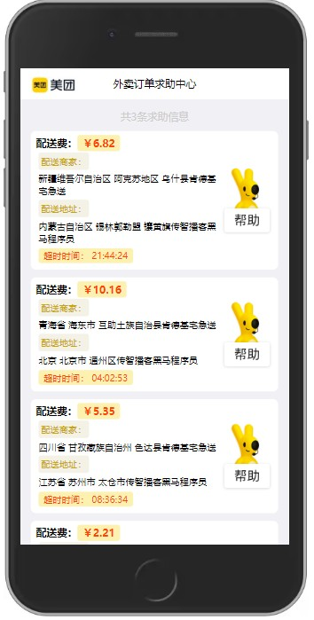

# 今日能力目标：

掌握组件传值的用法，能够理解`v-model`语法糖和`sync`修饰符的原理，能够封装常见的功能组件

**必要知识：**

3. 父组件向子组件**传递值**使用`:自定义属性名='属性值'`，子组件在`prop`中接收校验
4. 父组件向子组件**传递事件**`@自定义事件名='函数名'`，子组件可以通过`$emit`调用事件及传递参数
4. `v-model`语法糖的原理等同于**父组件**向**子组件**传递`value`属性和`input`事件，并且会自动更新`value`的值为`input`事件传递的参数
4. 非父子组件通信可以使用**事件总线**，使用`$emit`发送，使用`$on`接收
4. 在传递属性时使用`sync`修饰符相当于多传递了**input:属性名**的事件进行更新这个属性值
4. `$nextTick`可以用来执行**处理DOM**的操作，确保更新DOM后进行DOM操作

# 一、编程题

## 1.封装评价打分组件-综合题

**难度等级：**`★★`

**作业目标：**能够封装自定义组件，通过`v-model`对组件的值进行双向数据绑定

**考察能力：**

1. 能够使用`v-model`对组件进行值的绑定
1. 能够使用`props`接受组件传递的值
1. 能够使用`$emit`触发传递的事件
1. 能够使用`v-bind`对类名和属性进行控制

### 1.1 作业需求

**效果图需求如下：**(请自定义`EvaluationScore.vue`组件实现如图所示的效果)

 

**具体需求如下：**

1. 组件规范：

   | 属性名    | 说明                 | 可选值/默认值                      | 备注                                                         |
   | --------- | -------------------- | ---------------------------------- | ------------------------------------------------------------ |
   | `max`     | 打分显示的爱心总个数 | 正整数，默认值为5                  |                                                              |
   | `v-model` | 打分选中爱心的个数   | 正整数，默认值为1                  | 点击任意选项可以修改这个值                                   |
   | `size`    | 组件显示的尺寸       | ` small`或` large`，默认 `medium ` | `small`样式：font-size: 16px;<br />`medium`样式:font-size: 20px;<br />`large`样式:font-size: 24px; |

   

2. 使用示例：

   	

3. 需求描述：

   1. 自定义组件：自定义`EvaluationScore`组件，效果见需求演示
   2. 显示爱心的总数量：当传入`max`属性时，可以控制控制显示爱心的总个数，不传默认显示5个
   3. 显示选中爱心的数量：当使用`v-model`绑定值时，绑定的值是多少，红色爱心的个数就是多少，不传默认显示1个
   4. 选择爱心的数量：当点击任意的爱心，当前及之前的爱心变为选中，之后的爱心取消选中，同时更新`v-model`绑定的值
   5. 控制组件的尺寸：当传入`large`属性时，校验传入的内容是否为`small`、`medium`或`large`，根据传入的值显示对应的尺寸样式，不传默认显示`medium`的样式


### 1.2 相关素材

见附件

### 1.3 思路分析

1. 自定义组件：

   - 在`components`文件夹下创建`EvaluationScore.vue`
   - 在`App.vue`中引入创建的组件
   - 在`components`中注册组件
   - 在页面上显示组件
2. 显示爱心的总数量：

   - 在组件中使用`props`接收`max`值，`default`设置为5
   - 在模版中创建`span`标签,内容为🤍
   - 在`span`标签上使用`v-for`循环`max`次，生成所有的爱心
3. 显示选中爱心的数量：

   - 在组件中使用`props`接收`value`值，`default`设置为1
   - 修改`span`标签的内容，通过三元表达式判断当前循环项是否小于等于`value`，小于等于显示❤，否则显示🤍
4. 选择爱心的数量：

   - 给`span`标签绑定点击事件，并传入当前项的值，实现点击时获取当前选择爱心的数量
   - 在点击方法中，使用`$emit`调用`input`事件，并将参数也就是当前项传递实现更新数量
5. 控制组件的尺寸：

   - 在组件中使用`props`接收并校验`size`值,`default`设置为`medium`
- 在`style`标签中声明`small`、`large`类名，并设置对应的字体大小样式
   - 在根标签上添加一个类名，并设置字体大小为`medium`的字体大小
- 将传入的`size`动态绑定为类名，则会根据传入的属性实现对应的样式

### 1.4 参考答案

```html
<template>
  <div class="score-wrap" :class="size ? size : ''">
    <span
      class="score-item"
      v-for="item in max"
      :key="item"
      @click="changeScore(item)"
      >{{ item <= value ? "💗" : "🤍" }}</span
    >
  </div>
</template>

<script>
export default {
  props: {
    max: {
      type: Number,
      default: 5,
    },
    value: {
      type: Number,
      default: 1,
    },
    size: {
      type: String,
      default: "medium",
      validator: (value) => {
        return ["small", "medium", "large"].includes(value);
      },
    }
  },
  methods: {
    changeScore(score) {
      this.$emit("input", score);
    },
  },
};
</script>

<style scoped>
.score-wrap {
  padding: 5px 10px;
  font-size: 20px;
}
.small {
  font-size: 16px;
}
.large {
  font-size: 24px;
}
.score-item {
  cursor: pointer;
}
</style>
```

### 1.5 总结反馈

- [ ] 我看效果图就可以分析出实现步骤并独立完成
- [ ] 我看效果图没有思路，需要看本题思路分析才能完成
- [ ] 我需要看参考答案才能梳理思路和完成代码
- [ ] 我没有思路，也看不懂答案，无法完成本题

## 2. 封装按钮、弹层、提示框组件-变形题

**难度等级：**`★★★`

**作业目标：**能够封装自定义按钮组件、自定义弹层组件、自定义提示组件

**考察能力：**

1. 能够使用父子组件通信实现多种效果
2. 能够对`porps`进行类型和值的校验以及默认值的设置

### 2.1 作业需求

**效果图需求如下：**(请设计按钮、弹层、提示框组件实现如下图所示效果)

 

**具体需求如下：**

1. **按钮组件**

   - 组件规范：

   | 属性名  | 说明             | 可选值/默认值                                                | 备注                                                         |
   | ------- | ---------------- | ------------------------------------------------------------ | ------------------------------------------------------------ |
   | `value` | 按钮内显示的文字 | 默认值为`确定`                                               |                                                              |
   | `type`  | 按钮样式的风格   | 可选 `default`，`primary`, `success`, `info`, `danger`，默认值为`default` | `default`样式： color: #333;background-color: #fff;<br />`primary`样式： color: #fff;background-color: #E6A23C;<br />`success`样式： color: #fff;background-color: #67C23A;<br />`info`样式： color: #fff;background-color: #409EFF;<br />`danger`样式： color: #fff;background-color: #F56C6C;<br /> |
   | `size`  | 组件显示的尺寸   | ` small`或` large`，默认 `medium `                           | `small`样式：padding: 5px 10px;font-size: 12px;<br />`medium`样式:padding: 10px 20px;font-size: 14px;;<br />`large`样式:padding: 15px 30px;font-size: 16px; |

   | 事件名 | 说明                 | 备注                   |
   | ------ | -------------------- | ---------------------- |
   | click  | 点击按钮时触发的事件 | 组件的事件需要自己注册 |

   - 使用示例：

   	
   
   - 需求描述：
   
   1. 自定义组件：自定义`MyButton`组件，效果见需求演示
   2. 按钮组件文字：当使用`value`属性时，可以控制组件控制的**文字内容**，不传默认显示确定
   3. 按钮组件尺寸：当传入`size`属性时，校验传入的内容是否为`small`、`medium`或`large`，根据传入的值显示对应的**尺寸样式**，不传默认显示`medium`的样式
   4. 按钮组件的风格：当传入`type`属性时，校验传入的内容是否为`default`，`primary`, `success`, `info`,或`danger`，根据传入的值显示对应的**风格样式**，不传默认显示`default`的样式
   5. 控制组件的事件：当传入`click`事件时，**点击**组件，触发传入的事件
   
2. **弹层组件**

   - 组件规范：

   | 属性名    | 说明             | 可选值/默认值           | 备注 |
   | --------- | ---------------- | ----------------------- | ---- |
   | `v-model` | 弹层显示隐藏属性 | 布尔值，默认值为`false` |      |
   | `title`   | 弹层显示内容     | 默认显示`确认关闭吗？`  |      |

   | 事件名 | 说明                     | 备注                   |
   | ------ | ------------------------ | ---------------------- |
   | isOK   | 点击确定按钮时触发的事件 | 组件的事件需要自己注册 |

   

   - 使用示例：

   	

   - 需求描述：

   1. 自定义组件：自定义`MyDialog`组件，效果见需求演示
   2. 控制弹层显示隐藏：当使用`v-model`绑定值时，可以通过修改绑定的值控制弹层的**显示与隐藏**
   3. 取消按钮：使用封装`MyButton`组件实现取消功能，点击取消按钮**关闭弹层**
   4. 确定按钮：使用封装`MyButton`组件实现确定功能，点击确定按钮**关闭弹层并显示提示框**
   5. 弹层内容：当传入`title`属性时，弹层显示传入内容，默认显示`确认删除吗？`

3. **提示框组件**

   - 使用示例：

   	
   
   - 需求描述：
   
   1. 自定义组件：自定义`MyTip`组件，效果见需求演示
   1. 提示框显示：调用`MyTip`组件实例的`show`方法控制提示框显示，可以通过传入参数控制提示内容
   1. 自动关闭：提示`1s`后，提示框自动关闭

### 2.2 相关素材

无

### 2.3 思路分析

1. 自定义`MyButton`按钮组件：
   - 自定义组件:
     - 在`components`文件夹下创建`MyButton.vue`
     - 在`template`标签中添加`button`元素，完善样式
     - 在`main.js`中引入并全局注册`MyButton`组件，确保弹层组件也能使用
     - 在`MyButton.vue`使用`props`接收`value`属性,`default`设置为`确定`
   - 按钮组件文字:
     - 在组件中使用`props`接收`value`值,`default`设置为`确定`
     - 将组件传入的`value`动态绑定到`template`中`button`的`value`属性上，则`button`会根据传入的属性显示对应的文字
   - 按钮组件尺寸：
     - 在组件中使用`props`接收并校验`size`值,`default`设置为`medium`
     - 在`style`标签中声明`small`、`large`类名，并设置对应的字体大小样式
     - 在根标签上添加一个类名，并设置字体大小为`medium`的字体大小
     - 将传入的`size`动态绑定为类名，则会根据传入的属性实现对应的样式
   - 按钮组件风格：
     - 在组件中使用`props`接收并校验`type`值,`default`设置为`primary`
     - 在`style`标签中声明`primary`、`success`、`info`、`danger`类名，并设置对应的颜色样式
     - 在`button`标签上添加一个类名，并设置样式为`default`的样式
     - 将传入的`type`动态绑定为类名，则会根据传入的属性实现对应的样式
   
2. 自定义`MyDialog`弹层组件：

   - 自定义组件:
     - 在`components`文件夹下创建`MyDialog.vue`
     - 在`MyDialog`组件中引入`MyButton`组件，完善结构样式
     - 在`App.vue`中引入并注册`MyDialog`组件
   - 控制弹层显示隐藏:
     - 在`MyDialog`组件中，使用`props`接收`value`属性,`default`设置为`false`
     - 在根标签上添加`v-if="value"`，即可根据传入的值控制弹层的显示隐藏
   - 取消按钮:
     - 使用`MyButton`组件，绑定`click`事件，传入`closeDialog`方法
     - 在`closeDialog`方法中，通过`$emit`调用`v-model`传入的`input`事件更新`value`的值为`false`，即可点击关闭弹层
   - 确定按钮:
     - 使用`MyButton`组件，绑定`click`事件，传入`isOK`方法
     - 在`isOK`方法中，通过`$emit`调用父组件传入的`isOK`事件，即可点击确定实现相应功能
   - 显示内容
     - 在`MyDialog`组件中，使用`props`接收`title`属性,`default`设置为`确认关闭吗？`
     - 在`template`对应位置使用插值表达式显示`title`即可显示对应内容

3. 自定义`MyDialog`提示框组件：

   自定义`MyTip`弹层组件

   - 自定义组件:
     - 在`components`文件夹下创建`MyTip.vue`
     - 在`App.vue`中引入并注册`MyTip`组件
   - 提示框显示:
     - 在`MyTip`组件中，声明`visible`属性，默认值为`false`，根节点使用`v-if`绑定`visible`属性
     - 在`MyTip`组件中，声明`message`属性，将`message`使用插值表达式放入模版显示对应位置
     - 在`MyTip`组件中，声明`show`方法，参数为`message`，接受要显示的内容，
     - 在`show`方法中，将`message`属性更新为参数的`message`，即可在调用是根据传入的内容显示对应的内容
     - 在`show`方法中，将`visible`属性更新为`true`即可显示提示框
   - 自动关闭:
     - 在`show`方法中，开启延时器,`1s`后将将`visible`属性更新为`false`即可实现`1s`后自动关闭

4. 组件使用

   - 在页面分别显示`MyButton`、`MyDialog`、`MyTip`组件
   - 在`App.vue`声明`showDialog`属性，默认值为`false`，用来控制弹层显示隐藏
   - `MyButton`绑定`click`事件，点击时将`showDialog`更新为`true`，实现点击按钮显示弹层
   - 给`MyDialog`组件绑定`v-model=showDialog`，通过修改`showDialog`控制弹层显示隐藏，传入`title`属性，控制显示内容
   - 在`MyTip`组件添加`ref="myTip"`的方属性，通过`this.$refs.myTip`能获取到提示框组件实例
   - 在`App.vue`声明`isOK`方法，修改`showDialog`为`false`,调用提示框实例的`show`方法传入参数，实现关闭弹层，提示信息

### 2.4 参考答案

见附件

### 2.5 总结反馈

- [ ] 我看效果图就可以分析出实现步骤并独立完成
- [ ] 我看效果图没有思路，需要看本题思路分析才能完成
- [ ] 我需要看参考答案才能梳理思路和完成代码
- [ ] 我没有思路，也看不懂答案，无法完成本题

## 3. 美团外卖订单求助中心-二次开发

**难度等级：**`★★★★★`

**作业目标：**完成订单管理页面开发

**考察能力：**

1. 能够**看懂**已经提前准备好代码以及代码实现的对应效果
2. 能够在已有代码上完成**新增需求**，比如新增设备、删除设备、设备查询等

### 3.1 作业需求

**已有效果**：

 

**需求效果：**

 

**增加需求如下：**

1. 阅读代码，抽离组件：

   1. 将已有效果中**订单卡片**部分封装成组件`MyListItem`
   2. 组件效果如图:
2. 显示弹层：点击订单卡片中的帮助，**显示弹层**提示`确认帮忙处理此订单吗？`
3. 删除数据：点击确定按钮关闭弹层，**删除**该条帮助数据
4. 提示信息：删除数据后**提示**`转接成功，请尽快处理`,提示框`1s`后**消失**

**提示：可以复用已封装的按钮、弹层、提示框组件，列表Mock数据结构如下图**


### 3.2 相关素材

见附件

### 3.3 思路分析

1. 阅读代码：

   - 梳理提供的代码，明确新增需求
2. 抽离组件

   - 新建`MyListItem.vue`组件，复制对应结构和样式
   - 在`MyOrderList`中循环`MyListItem`组件，并传入`info`属性，值为循环项
   - 在组件`props`中接收`info`属性,在对应位置显示内容
3. 显示弹层：

   - 在`MyListItem`组件`image`标签上添加`click`事件绑定`acceptOrder`方法,并传递`orderId`
   - 创建事件总线，并在`MyListItem`导入
   - 在`acceptOrder`方法中通过`Bus.$emit('acceptOrder')`通知`App.vue`，并传递参数`orderId`
   - 在`App.vue`中导入事件总线，在`created`周期通过`Bus.$on('acceptOrder')`接收通知
   - 在`App.vue`的`data`中声明`acceptId`用来记录点击的`id`
   - 并在`$on`的回调函数中将`acceptId`更新为传递的`orderId`,同时将`showDialog`更新为`true`，此时点击帮助，显示弹层，并且记录点击的`orderId`
4. 删除数据：

   - 在`App.vue`中声明`doAccept`方法，绑定给`MyDialog`组件的`isOK`方法，点击弹层确定时触发此方法
   - 在`doAccept`方法中，使用`filter`对`orderList`进行过滤，条件是当前项的`id`不等于记录的`accept`，过滤出非点击的其他订单，并更新给`orderList`，此时数据发生更新，视图自动更新，实现数据删除
### 3.4 参考答案

见附件

### 3.5 总结反馈

- [ ] 我看效果图就可以分析出实现步骤并独立完成
- [ ] 我看效果图没有思路，需要看本题思路分析才能完成
- [ ] 我需要看参考答案才能梳理思路和完成代码
- [ ] 我没有思路，也看不懂答案，无法完成本题

# 二、问答题

## 谈谈你对`sync` 修饰符的理解？

**难度等级：**★★

**考察能力**：

1. 理解`sync`修饰符的使用场景
2. 掌握`sync`修饰符的语法

### 问答要点

1. `sync` 修饰符是用来做什么的？
2. `v-model`也能进行双向数据绑定，他们的区别是什么？如何选择？
3. 父组件使用`sync`修饰符传递的值在子组件中如何修改？

### 参考答案

```markdown
作用：
	sync修饰符用于实现子组件对父组件属性的双向绑定
	
区别：
	v-model一个组件只能使用一次，组件必须以value属性接收，触发input事件更新，而给属性添加sync修饰符除了属性传递属性，还会传入一个更新属性的事件，这个事件的命名是update:属性名，如果只需要传递一个值进行修改，且对传入的值命名没有限制，推荐使用v-model，如果子组件需要传入多个属性，并且进行修改，则推荐对属性添加sync修饰符

修改：
	当子组件需要修改父组件传递的带有sync修饰符的属性时，可以通过$emit('update:属性名',属性值)进行修改
```


## 谈谈你对`$nextTick` 的理解？ 

**难度等级：**★★

**考察能力**

1. 掌握`$nextTick`的使用场景
2. 理解`$nextTick`和`setTimeout`的区别

### 问答要点

1. 在什么情况下会用到 `$nextTick`？
1. `$nextTick` 和 `setTimeout` 之间有什么区别？

### 参考答案

```markdown
场景
	因为DOM更新是异步的，当需要在更新DOM结构之后执行一些DOM操作时，可以使用 $nextTick来确保操作发生在DOM更新之后。
区别
	$nextTick 在下一个 DOM 更新周期之后执行，是微任务，而 setTimeout 会在指定的时间间隔之后执行，是宏任务，$nextTick 更适合用于处理 Vue 的 DOM 更新
```

 

## 你知道的组件通信方式有哪些？ 

**难度等级：**★★★

**考察能力**

1. 掌握父子组件通信方式
2. 掌握事件总线通信的方式

### 问答要点

1. 父组件如何向子组件传递属性和传递事件，子组件如何接收属性和接收事件
1. 子组件如何向父组件传递属性和传递事件，父组件如何接收属性和接收事件
1. 非父子组件如何通信？
1. `watch`如何实现深度监听

### 参考答案

```markdown
父向子传递：
	父组件传递属性时---使用:属性名=属性值，其中属性名为自定义，值为data的变量(不使用动态绑定也可以传递常量)
	父组件传递事件时---使用@事件名=函数名，其中事件名为自定义，函数名为methods重的函数名称
	子组件接收属性时---使用props接收属性名，可以使用数组接收，也可以使用对象接收。其中对象接收可以设置类型、默认值、校验函数等。
	子组件接收事件时---无任何操作(可以使用$emit(事件名)直接调用父组件传递的事件)
子向父传递：
	子组件传递属性时---使用$emit(事件名,值)通过父组件传递的方法向父组件进行值的传递
	子组件传递事件时---无任何操作(可以在父组件通过ref属性获取子组件实例，即可在父组件调用子组件的方法)
	父组件接收属性时---可以在data生命变量，在传递给子组件的方法中更新这个变量，保存子组件传递的值
	父组件接收事件时---无任何操作(可以在父组件通过ref属性获取子组件实例，即可在父组件调用子组件的方法)
非父子组件：
	使用事件总线，新建js文件，导入Vue，实例化Vue函数得到Bus对象，导出这个Bus对象，需要发通知的地方可以使用Bus.$emit('事件的名称',参数)，需要接收通知的地方可以使用Bus.$on('事件的名称'，(参数)=>{//相应的操作})
```


# 三. 自主学习题

## native修饰符

**难度等级：**`★★`

自定义按钮组件的时候，需要接收父组件传递的`click`事件，再给`button`绑定`click`事件，`button`的`click`调用传入的`click`，才能实现给组件绑定事件，如图所示

 

### 题目要求

阅读参考教程，尝试使用`native`修饰符实现组件内不给`button`绑定传入的`click`，将原生按钮的点击事件绑定到组件上

### 参考教程

 

### 相关素材

在**封装按钮、弹层、提示框组件-变形题**中实现

### 参考答案

使用组件：

 

`MyButton.vue`组件代码：

```js
<template>
  <button>按钮</button>
</template>

<script>
export default {

}
</script>

<style>

</style>
```

### 总结提炼

- 需要触发组件内的源生时可以直接在组件事件上添加`native`修饰符

# 四、选择题

1. 事件总线的`Bus.$on()`，一般在哪里执行？


   A： computed

   B： watch

   C： created

   D： mounted

   答案：D

   解析： created阶段属性和方法创建完毕，就可以对事件进行监听了

   2.事件总线的`Bus.$emit()`发起了一个通知，可以没有组件接收这个通知吗？


   A： 可以

   B： 不行

   答案：A

   解析： `$emit`和`$on`并不一定需要捆绑使用，`$emit`只发送通知不关心接收方，`$on`只接收不关心最终有没有人发送

   3.下列选项中，哪些是对象？(可多选)


   A： computed

   B： watch

   C： components

   D： created

   答案：A、B

   解析： computed、watch和components是对象，created是函数

4. 下列选项中，哪些是函数？(可多选)


   A： created

   B： mounted

   C： components

   D： data

   答案：A、B、D

   解析： 声明周期都是函数，data也是一个函数，他的返回值是一个对象。

   5.下列选项中，`props`语法没有错误的是？(可多选)

   A：

```
props:['value']
```

​    B：

```
props:{
	value:String
}
```

​    C：

```
props:{
	value:{
		type:String,
		defalut:'message'
	}
}
```

   D：

```
props:{
	value:{
		type:String,
		validator:(val)=>{
			return val.length>0
		}
	}
}
```

   答案：A、B、C、D

   解析：三种写法都符合`props`语法规范


