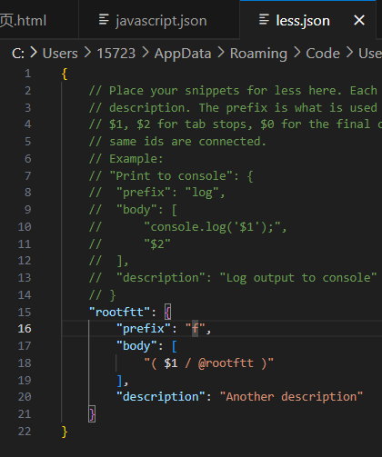
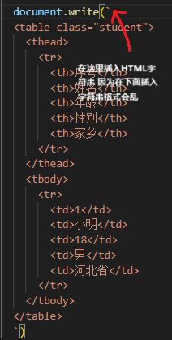

## vscode快捷键
ctrl+tab 快速切换文件夹

## VSCode 快捷方式log去掉分号
https://blog.csdn.net/qq_39921135/article/details/139321227

## 一个在百度快速打开MDN网站的办法

## log前的abc单词不要在最上面

## 用户代码片段问题
- 首先要清楚你要在哪种文件下的代码片段 不能就是 你要css的代码片段 然后你在html.json中去输入 
就比如我这次我需要在less文件中的代码片段 所以我需要在less.json文件中设置 而不是去css.json中去设置

## 重新配置完环境变量 要重启vs才能生效
重启vscode环境变量才会注入

## 突然多处的折叠符号 解决方案
{width=600px}

## vscode代码提示框 提示顺序调整
{width=700px}

## 模板字符串中 插入html字符串格式混乱问题
{width=200px}

## 每次打开之后弹出自动更新 如何关闭
https://blog.csdn.net/2301_77292637/article/details/143492511
